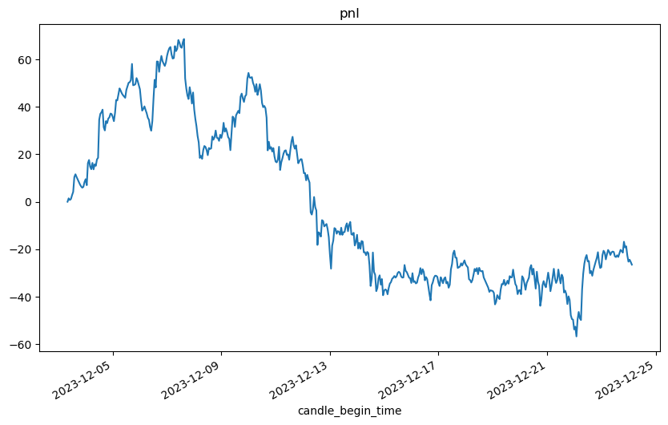
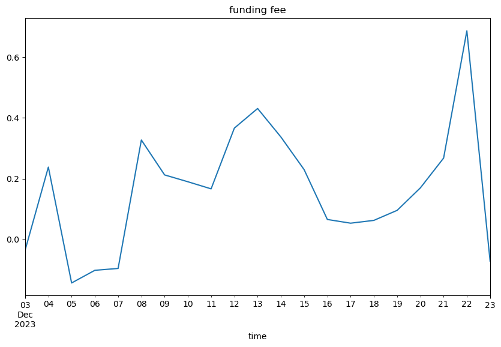
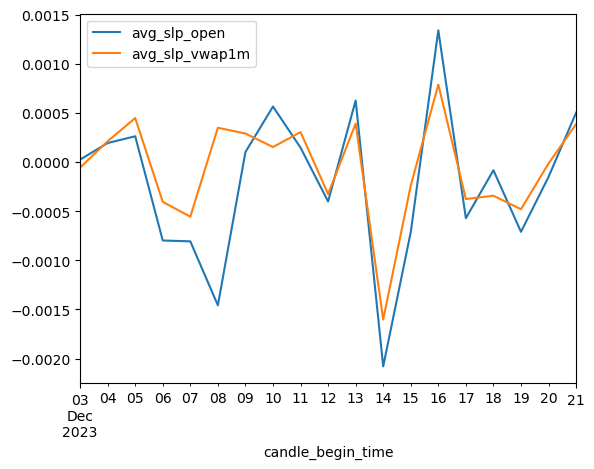

从 20231203 到 20231224，实盘保温杯中性策略 20 天左右

本文对实盘期间的运行状况进行总结，包括资金曲线、滑点、资金费等

本文也提出了 NEO 多标的回测引擎，并分析了 NEO 多标的回测引擎和实盘资金曲线的贴合程度，并基于该引擎回测结果和实盘下单记录对最大回撤进行了归因

# 整体回顾

## 参数总结

对保温杯实盘主要参数总结如下

|              | Strategy_NetTaBuyStdUpSample |
| :----------- | :--------------------------- |
| 因子         | NetTaBuyStdUpSample          |
| 回看窗口     | 7D                           |
| 持仓时间     | 24H                          |
| 模式         | 纯合约，无现货               |
| 持仓数量     | 多10空10                     |
| offset       | 0                            |
| 初始投入资金 | 1500                         |
| 结束资金     | 1471.33                      |

## 期间 PNL 曲线

基于实盘记录的 `equity.csv`，打印出资金曲线

``` python
eq = pd.read_csv('NetTaBuyStdUpSample/账户信息/equity.csv', encoding='gbk', parse_dates=['time'])

# 时间戳与小时线 candle_begin_time 对齐
t = eq['time'].astype(int)
t -= t % (3600 * 10**9)
eq['candle_begin_time'] = pd.to_datetime(t, unit='ns').dt.tz_localize('hongkong').dt.tz_convert('UTC')

eq.set_index('candle_begin_time', inplace=True)

eq['pnl'] = eq['账户总净值'] - eq['账户总净值'].iat[0]
eq['pnl'].plot(figsize=(10,6), title='pnl')

print(eq.tail().to_markdown())
```
| candle_begin_time         | time                | 账户总净值 | 多头现货 | 多头合约 | 多头仓位 | 空头仓位 |    pnl |
| :------------------------ | :------------------ | ---------: | -------: | -------: | -------: | -------: | -----: |
| 2023-12-23 23:00:00+00:00 | 2023-12-24 07:03:41 |    1475.18 |        0 |   738.84 |   738.84 |  -748.58 | -22.69 |
| 2023-12-24 00:00:00+00:00 | 2023-12-24 08:03:45 |    1472.59 |        0 |   735.92 |   735.92 |  -751.95 | -25.28 |
| 2023-12-24 01:00:00+00:00 | 2023-12-24 09:03:42 |    1473.42 |        0 |   734.23 |   734.23 |  -749.47 | -24.45 |
| 2023-12-24 02:00:00+00:00 | 2023-12-24 10:03:44 |    1472.47 |        0 |   736.95 |   736.95 |  -753.09 |  -25.4 |
| 2023-12-24 03:00:00+00:00 | 2023-12-24 11:03:43 |    1471.33 |        0 |   737.48 |   737.48 |   -754.8 | -26.54 |

由下图可知，上线不久盈利达到最高点（大约1208），之后 1210 到 1213 期间发生了一波较大回撤，之后一直呈震荡状态



# 订单与资金费记录下载

为了分析下单执行与资金费历史，首先开发了一个下载订单历史和资金费历史的脚本 `get_binance_history.py`

使用前需要将该脚本放在保温杯目录中，用法为 

``` python
python get_binance_history.py 账户名称 起始日期 结束日期
```

其中，账户名称为保温杯中性 `config.py` 中 `apikey_config` 字典里面的账户名

运行结束后会在 `data/账户名称/` 中生成 `funding_history` 和 `order_history` 两个文件

运行结束后，保温杯中性目录结构形如

```
.
├── startup.py
├── config.py
├── data_center.py
├── get_binance_history.py
├── data
│   ├── data_center
│   │   └── kline
│   ├── flag
│   ├── NetTaBuyStdUpSample
│   │   ├── funding_history
│   │   │   ├── 20231203.csv
│   │   │   ├── 20231204.csv
│   │   │   ├── ...
│   │   ├── order_history
│   │   │   ├── 20231203.csv
│   │   │   ├── 20231204.csv
│   │   │   ├── ...
│   │   └── 账户信息
│   │       └── equity.csv
│   └── select_coin
├── ...
```

`get_binance_history.py` 关键函数为 `ccxt_request_account_orders` 和 `ccxt_request_account_funding`

## 获取下单历史 `ccxt_request_account_orders`

``` python
def ccxt_request_account_orders(api_key, secret, dt):
    # 计算当天起始与结束时间戳，单位为毫秒
    start = pd.to_datetime(f'{dt} 00:00:00')
    end = start + pd.Timedelta(days=1)
    ts_start = start.value // 1000000
    ts_end = end.value // 1000000 - 1

    # 生成 ccxt binance 实例，调用 /fapi/v1/allOrders 接口
    exg = ccxt.binance({'apiKey': api_key, 'secret': secret, 'timeout': EXCHANGE_TIMEOUT_MS})
    param = {'startTime': ts_start, 'endTime': ts_end, 'limit': 1000}
    data = exg.fapiPrivateGetAllOrders(param)

    # 将接口返回的 json 数据，转换为 DataFrame
    df = pd.DataFrame(data)
    df['time'] = pd.to_datetime(df['time'], unit='ms', utc=True)  # 时间
    df['order_id'] = df['orderId'].astype(np.uint64)  # 订单ID
    df['orig_price'] = df['price'].astype(np.float64)  # 下单价格
    df['orig_qty'] = df['origQty'].astype(np.float64)  # 下单数量
    df['filled_price'] = df['avgPrice'].astype(np.float64)  # 成交价格
    df['filled_qty'] = df['executedQty'].astype(np.float64)  # 成交数量
    return df[
        ['time', 'order_id', 'symbol', 'origType', 'side', 'orig_price', 'orig_qty', 'filled_price', 'filled_qty']
    ]
```

## 获取资金费历史 `ccxt_request_account_funding`

``` python
def ccxt_request_account_funding(api_key, secret, dt):
    # 计算当天起始与结束时间戳，单位为毫秒
    start = pd.to_datetime(f'{dt} 00:00:00')
    end = start + pd.Timedelta(days=1)
    ts_start = start.value // 1000000
    ts_end = end.value // 1000000 - 1

    # 生成 ccxt binance 实例，调用 /fapi/v1/income 接口
    exg = ccxt.binance({'apiKey': api_key, 'secret': secret, 'timeout': EXCHANGE_TIMEOUT_MS})
    param = {'incomeType': 'FUNDING_FEE', 'startTime': ts_start, 'endTime': ts_end, 'limit': 1000}
    data = exg.fapiPrivateGetIncome(param)

    # 将接口返回的 json 数据，转换为 DataFrame
    df = pd.DataFrame(data)
    df['time'] = pd.to_datetime(df['time'], unit='ms', utc=True)  # 时间
    df['income'] = df['income'].astype(np.float64)  # 资金费
    return df[['time', 'symbol', 'incomeType', 'asset', 'income']]
```

# 资金费分析

基于下载的资金费历史，使用以下代码，总结每日资金费，并画出每日累计资金费

``` python
paths = sorted(glob('NetTaBuyStdUpSample/funding_history/*.csv'))
dfs = [pd.read_csv(p) for p in paths]

df_funding = pd.concat(dfs)
df_funding['time'] = pd.to_datetime(df_funding['time'])

funding_day = df_funding.resample('D', on='time').sum()[['income']]
funding_day['cum_funding'] = funding_day['income'].cumsum()

funding_day['cum_funding'].plot(figsize=(10,6), title='funding fee')

print(funding_day.tail().to_markdown())
```

| time                      |     income |   cum_funding |
|:--------------------------|-----------:|--------------:|
| 2023-12-19 00:00:00+00:00 |  0.0330066 |     0.0953575 |
| 2023-12-20 00:00:00+00:00 |  0.0740516 |     0.169409  |
| 2023-12-21 00:00:00+00:00 |  0.098246  |     0.267655  |
| 2023-12-22 00:00:00+00:00 |  0.419458  |     0.687113  |
| 2023-12-23 00:00:00+00:00 | -0.759289  |    -0.072176  |



可以看出，期间累计资金费不超过 1USDT

因此运行期间，资金费影响不大，可以忽略不计

# 滑点分析

## 1. 合并订单记录
首先，基于以下代码，合并订单记录并进行基本的处理

``` python
paths = sorted(glob('NetTaBuyStdUpSample/order_history/*.csv'))

# 合并下单记录，并保留需要的列
dfs = [pd.read_csv(p) for p in paths]
df_order = pd.concat(dfs, ignore_index=True)
df_order['time'] = pd.to_datetime(df_order['time'])
df_order = df_order[['time', 'symbol', 'side', 'orig_price', 'filled_price', 'filled_qty']]

# 计算成交金额
df_order['turnover'] = df_order['filled_price'] * df_order['filled_qty']

# 去除掉策略上线前无用的测试订单
df_order = df_order[(df_order['time'] >= '2023-12-03 08:00:00+00:00')]

# 时间戳与小时线 candle_begin_time 对齐
t = df_order['time'].astype(int)
t -= t % (3600 * 10**9)
df_order['candle_begin_time'] = pd.to_datetime(t, unit='ns', utc=True)

# 将每根小时线上同一标的同一方向的订单合并
df_order = df_order.groupby(['candle_begin_time', 'symbol', 'side'], 
                            as_index=False)[['turnover', 'filled_qty']].sum()
df_order['filled_price'] = df_order['turnover'] / df_order['filled_qty']

# 将 BUY 和 SELL 改为 1 和 -1
df_order['dire'] = 1
df_order.loc[df_order['side'] == 'SELL', 'dire'] = -1

print(df_order.tail().to_markdown())
```

|     | candle_begin_time         | symbol    | side   |   turnover |   filled_qty |   filled_price |   dire |
|----:|:--------------------------|:----------|:-------|-----------:|-------------:|---------------:|-------:|
| 261 | 2023-12-23 00:00:00+00:00 | ONGUSDT   | BUY    |    72.1536 |          192 |      0.3758    |      1 |
| 262 | 2023-12-23 00:00:00+00:00 | SPELLUSDT | BUY    |    72.4055 |       117389 |      0.0006168 |      1 |
| 263 | 2023-12-23 00:00:00+00:00 | STORJUSDT | SELL   |    71.7678 |           78 |      0.9201    |     -1 |
| 264 | 2023-12-23 00:00:00+00:00 | TLMUSDT   | BUY    |    72.2587 |         4122 |      0.01753   |      1 |
| 265 | 2023-12-23 00:00:00+00:00 | XVGUSDT   | BUY    |    72.2829 |        19478 |      0.003711  |      1 |

## 2. 计算每笔订单滑点

``` python
dfs = []

# 对每个标的分别处理
for sym, sym_ord in df_order.groupby('symbol'):
    # 读取邢大币对分类 1 小时合约 K 线
    p = os.path.join('swap_binance_1h', f'{sym.replace("USDT", "-USDT")}.csv')
    candle = pd.read_csv(p, encoding='GBK', skiprows=1, parse_dates=['candle_begin_time'])
    candle['candle_begin_time'] = candle['candle_begin_time'].dt.tz_localize('UTC')
    
    # 合并开盘价 open 和 1 分钟 VWAP avg_price_1m
    sym_ord = sym_ord.join(candle.set_index('candle_begin_time')[['open', 'avg_price_1m']], 
                           on='candle_begin_time', how='inner')
    
    # 对 open 滑点
    sym_ord['slp_open'] = -(sym_ord['filled_price'] / sym_ord['open'] - 1) * sym_ord['dire']
    
    # 对 1 分钟 VWAP 滑点
    sym_ord['slp_vwap1m'] = -(sym_ord['filled_price'] / sym_ord['avg_price_1m'] - 1) * sym_ord['dire']
    dfs.append(sym_ord)

order = pd.concat(dfs, ignore_index=True)
print(order.tail().to_markdown())
```

| candle_begin_time         | symbol   | side   |   turnover |   filled_qty |   filled_price |   dire |     open |   avg_price_1m |    slp_open |   slp_vwap1m |
|:--------------------------|:---------|:-------|-----------:|-------------:|---------------:|-------:|---------:|---------------:|------------:|-------------:|
| 2023-12-07 00:00:00+00:00 | XTZUSDT  | BUY    |    76.3776 |         86.4 |      0.884     |      1 | 0.882    |     0.882598   | -0.00226757 | -0.00158873  |
| 2023-12-09 00:00:00+00:00 | XTZUSDT  | SELL   |    81.8208 |         86.4 |      0.947     |     -1 | 0.947    |     0.946951   |  0          |  5.14686e-05 |
| 2023-12-14 00:00:00+00:00 | XVGUSDT  | BUY    |    75.0523 |      19957   |      0.0037607 |      1 | 0.003746 |     0.00375644 | -0.00392419 | -0.00113532  |
| 2023-12-19 00:00:00+00:00 | XVGUSDT  | BUY    |     5.0694 |       1491   |      0.0034    |      1 | 0.003409 |     0.00340672 |  0.00264007 |  0.00197345  |
| 2023-12-21 00:00:00+00:00 | XVGUSDT  | SELL   |    75.9259 |      21448   |      0.00354   |     -1 | 0.003535 |     0.00353765 |  0.00141443 |  0.000663039 |

其中，滑点可以有正有负

- 正的滑点代表盈利，表示买得比 open/vwap 便宜，或卖得比 open/vwap 贵，为好的滑点；
  例如 XVGUSDT 2023-12-19 00:00:00 这一笔订单，open 为 0.003409，成交价为 0.0034, 买得更便宜，因此滑点为正

- 负的滑点代表亏损，表示买得比 open/vwap 贵，或卖得比 open/vwap 便宜，为坏的滑点；
  例如 XVGUSDT 2023-12-14 00:00:00 这一笔订单，open 为 0.003746，成交价为 0.0037607, 买得更贵，因此滑点为负

## 3. 总滑点及每日滑点

我们以成交额为权重，计算每日及总计滑点加权平均

``` python
# 滑点乘以权重(成交额)
order['slp_open_trv'] = order['slp_open'] * order['turnover']
order['slp_vwap1m_trv'] = order['slp_vwap1m'] * order['turnover']

# 打印总滑点
print('Avg slp open {:.2f} bps'.format(order['slp_open_trv'].sum() / order['turnover'].sum() * 10000))
print('Avg slp vwap1m {:.2f} bps'.format(order['slp_vwap1m_trv'].sum() / order['turnover'].sum() * 10000))

# 对每日 resample
g = order.resample('D', on='candle_begin_time')[['slp_open_trv', 'slp_vwap1m_trv', 'turnover']].sum()

# 对 open 每日滑点
slp_open_sym = (g['slp_open_trv'] / g['turnover'])
slp_open_sym.name = 'avg_slp_open'

# 对 vwap 每日滑点
slp_vwap1m_sym = (g['slp_vwap1m_trv'] / g['turnover'])
slp_vwap1m_sym.name = 'avg_slp_vwap1m'

slp_day = slp_open_sym.to_frame().join(slp_vwap1m_sym)
slp_day.plot()
```

则有

```
Avg slp open -1.40 bps
Avg slp vwap1m -0.04 bps
```



可以看出，运行期间对 open 平均滑点为 -1.4 基点 (万分之1.4)，对 VWAP1m 平均滑点为 -0.04 基点 (万分之0.04)

因此，在不考虑手续费返还的情况下，使用开盘价回测，综合交易成本万分之 6 为合理估计（中性船队传统）；在使用 vwap1m 回测时，可以忽略滑点

## 4 按标的计算滑点

基于以下代码，计算每个标的平均滑点

``` python
order['slp_open_trv'] = order['slp_open'] * order['turnover']
order['slp_vwap1m_trv'] = order['slp_vwap1m'] * order['turnover']


g = order.groupby('symbol')[['slp_open_trv', 'slp_vwap1m_trv', 'turnover']].sum()

slp_open_sym = (g['slp_open_trv'] / g['turnover'])
slp_open_sym.name = 'avg_slp_open'

slp_vwap1m_sym = (g['slp_vwap1m_trv'] / g['turnover'])
slp_vwap1m_sym.name = 'avg_slp_vwap1m'

slp_sym = slp_open_sym.to_frame().join(slp_vwap1m_sym)

print(
    pd.concat([slp_sym.sort_values('avg_slp_open').head(3), 
               slp_sym.sort_values('avg_slp_open').tail(3)]).to_markdown(),
    '\n\n',
    pd.concat([slp_sym.sort_values('avg_slp_vwap1m').head(3), 
               slp_sym.sort_values('avg_slp_vwap1m').tail(3)]).to_markdown()
)


print(
    order[order['symbol'] == 'ONTUSDT'].to_markdown(), '\n\n',
    order[order['symbol'] == 'JTOUSDT'].to_markdown()
)
```

| symbol      |   avg_slp_open |   avg_slp_vwap1m |
|:------------|---------------:|-----------------:|
| ONTUSDT     |    -0.00643369 |       0.00258414 |
| XEMUSDT     |    -0.00525555 |      -0.00271524 |
| 1000XECUSDT |    -0.00282617 |      -0.00266741 |
| USTCUSDT    |     0.00254407 |       0.00244451 |
| MEMEUSDT    |     0.00322332 |       0.00291774 |
| JTOUSDT     |     0.00460887 |       0.00313891 | 

| symbol      |   avg_slp_open |   avg_slp_vwap1m |
|:------------|---------------:|-----------------:|
| XEMUSDT     |    -0.00525555 |      -0.00271524 |
| 1000XECUSDT |    -0.00282617 |      -0.00266741 |
| DODOXUSDT   |    -0.00241987 |      -0.00205371 |
| MEMEUSDT    |     0.00322332 |       0.00291774 |
| JTOUSDT     |     0.00460887 |       0.00313891 |
| AUDIOUSDT   |     0.00147193 |       0.00327629 |

加密货币市场具有较大波动性，不同标的不同时间滑点差距都较大，以下是平均滑点最大最小的两个例子

| candle_begin_time         | symbol   | side   |   filled_price |   filled_qty |   turnover |   open |    slp_open |   avg_price_1m |   slp_vwap1m |
|:--------------------------|:---------|:-------|---------------:|-------------:|-----------:|-------:|------------:|---------------:|-------------:|
| 2023-12-17 00:00:00+00:00 | XEMUSDT  | BUY    |         0.0392 |         1871 |    73.3432 | 0.039  | -0.00512821 |      0.039095  |  -0.00268648 |
| 2023-12-19 00:00:00+00:00 | XEMUSDT  | SELL   |         0.0369 |         1871 |    69.0399 | 0.0371 | -0.00539084 |      0.0370016 |  -0.0027458  | 

 | candle_begin_time         | symbol   | side   |   filled_price |   filled_qty |   turnover |   open |    slp_open |   avg_price_1m |   slp_vwap1m |
|:--------------------------|:---------|:-------|---------------:|-------------:|-----------:|-------:|------------:|---------------:|-------------:|
| 2023-12-16 00:00:00+00:00 | JTOUSDT  | SELL   |        2.85994 |           26 |    74.3585 | 2.842  |  0.00631316 |        2.84693 |   0.00457013 |
| 2023-12-19 00:00:00+00:00 | JTOUSDT  | SELL   |        2.4946  |            3 |     7.4838 | 2.5045 | -0.00395288 |        2.50614 |  -0.00460513 |
| 2023-12-20 11:00:00+00:00 | JTOUSDT  | SELL   |        2.6062  |            2 |     5.2124 | 2.6197 | -0.00515326 |        2.61265 |  -0.00247    |
| 2023-12-21 00:00:00+00:00 | JTOUSDT  | BUY    |        2.6492  |            4 |    10.5968 | 2.6585 |  0.00349821 |        2.65271 |   0.00132392 |

# 实盘模拟及回撤归因

## 实盘仓位重建

首先，根据下单历史，计算每个标的仓位历史

```
df_pos = df_order.copy()

# 计算带方向的成交量
df_pos['sided_qty'] = df_pos['filled_qty'] * df_pos['dire']
df_pos['pos'] = df_pos.groupby('symbol')['sided_qty'].cumsum()

df_pos = df_pos[['candle_begin_time', 'symbol', 'sided_qty', 'pos']]
print(df_pos[df_pos['symbol'] == 'XRPUSDT'].to_markdown(index=False))
```

XRPUSDT 仓位历史如下

| candle_begin_time         | symbol   |   sided_qty |    pos |
|:--------------------------|:---------|------------:|-------:|
| 2023-12-03 08:00:00+00:00 | XRPUSDT  |      -120.5 | -120.5 |
| 2023-12-09 01:00:00+00:00 | XRPUSDT  |         7.6 | -112.9 |
| 2023-12-12 00:00:00+00:00 | XRPUSDT  |        -9.6 | -122.5 |

将每个标的与 BMAC 1 小时 K 线对齐

```python
# 从 bmac 实盘导出 exchange info，并获取每个合约面值(最小下单量)
exginfo = pd.read_feather('exginfo.fea').set_index('symbol')
fv = exginfo['face_value'].astype('float')

# 保温杯上线起始时间
ts_start = pd.to_datetime('2023-12-03 08:00:00+00:00')

dfs = []

# 对每个标的分别处理
for sym, sym_pos in df_pos.groupby('symbol'):
    # 读取 bmac 合约 1 小时 K 线，也可以使用邢大币对 K 线
    p = os.path.join('usdt_swap_1h', f'{sym}.fea')
    candle = pd.read_feather(p)
    candle = candle[(candle['candle_begin_time'] >= ts_start)]
    
    # 仓位与 K 线对齐，合并 open close
    sym_pos = sym_pos[['candle_begin_time', 'pos']]
    candle = candle.set_index('candle_begin_time')[['open', 'close']]
    sym_pos = sym_pos.join(candle, on='candle_begin_time', how='outer').reset_index(drop=True)
    sym_pos.sort_values('candle_begin_time', inplace=True, ignore_index=True)
    
    
    sym_pos['pos'] = sym_pos['pos'].ffill().fillna(0)  # 填充仓位
    sym_pos['lots'] = (sym_pos['pos'] / fv.loc[sym]).round().astype(int)  # 根据仓位计算持仓手数

    sym_pos['symbol'] = sym
    
    dfs.append(sym_pos)

pos_hour = pd.concat(dfs).sort_values(['candle_begin_time', 'symbol'])

print(pos_hour[pos_hour['symbol'] == 'XRPUSDT'].tail(8).to_markdown(index=False))
print(pos_hour[pos_hour['symbol'] == 'XVGUSDT'].tail(8).to_markdown(index=False))
```

XRPUSDT 和 XVGUSDT 最后 8 小时持仓分别为

| candle_begin_time         |    pos |   open |   close |   lots | symbol   |
|:--------------------------|-------:|-------:|--------:|-------:|:---------|
| 2023-12-23 21:00:00+00:00 | -122.5 | 0.6182 |  0.6184 |  -1225 | XRPUSDT  |
| 2023-12-23 22:00:00+00:00 | -122.5 | 0.6183 |  0.6199 |  -1225 | XRPUSDT  |
| 2023-12-23 23:00:00+00:00 | -122.5 | 0.6199 |  0.62   |  -1225 | XRPUSDT  |
| 2023-12-24 00:00:00+00:00 | -122.5 | 0.62   |  0.6185 |  -1225 | XRPUSDT  |
| 2023-12-24 01:00:00+00:00 | -122.5 | 0.6186 |  0.6198 |  -1225 | XRPUSDT  |
| 2023-12-24 02:00:00+00:00 | -122.5 | 0.6197 |  0.6228 |  -1225 | XRPUSDT  |
| 2023-12-24 03:00:00+00:00 | -122.5 | 0.6229 |  0.6209 |  -1225 | XRPUSDT  |
| 2023-12-24 04:00:00+00:00 | -122.5 | 0.6209 |  0.6216 |  -1225 | XRPUSDT  |

| candle_begin_time         |   pos |     open |    close |   lots | symbol   |
|:--------------------------|------:|---------:|---------:|-------:|:---------|
| 2023-12-23 21:00:00+00:00 | 19478 | 0.003698 | 0.003693 |  19478 | XVGUSDT  |
| 2023-12-23 22:00:00+00:00 | 19478 | 0.003693 | 0.003691 |  19478 | XVGUSDT  |
| 2023-12-23 23:00:00+00:00 | 19478 | 0.003693 | 0.003737 |  19478 | XVGUSDT  |
| 2023-12-24 00:00:00+00:00 |     0 | 0.003737 | 0.003713 |      0 | XVGUSDT  |
| 2023-12-24 01:00:00+00:00 |     0 | 0.003713 | 0.003744 |      0 | XVGUSDT  |
| 2023-12-24 02:00:00+00:00 |     0 | 0.003743 | 0.003723 |      0 | XVGUSDT  |
| 2023-12-24 03:00:00+00:00 |     0 | 0.003723 | 0.003724 |      0 | XVGUSDT  |
| 2023-12-24 04:00:00+00:00 |     0 | 0.003724 | 0.003719 |      0 | XVGUSDT  |

需要注意的是，lots（持仓手数）为带符号的整数，在 NEO 系统内部，所有的持仓量均为带符号整数

就像你账户上有 123.45 元，计算机系统内部应该记为你持有人民币 12345 分

## 回测模拟及验证

首先，准备好 open, close, lots 的数据透视表

```python
lots = pos_hour.pivot_table(index='candle_begin_time', columns='symbol', values='lots')
lots = lots.ffill().fillna(0).astype(int)

op = pos_hour.pivot_table(index='candle_begin_time', columns='symbol', values='open')
cl = pos_hour.pivot_table(index='candle_begin_time', columns='symbol', values='open')

print(lots[['XVGUSDT', '1000SATSUSDT', 'ONGUSDT', 'TUSDT']].tail(8).to_markdown())
```

其中几个标的近几个小时持仓手数透视表如下

| candle_begin_time         |   XVGUSDT |   1000SATSUSDT |   ONGUSDT |   TUSDT |
|:--------------------------|----------:|---------------:|----------:|--------:|
| 2023-12-23 21:00:00+00:00 |     19478 |              0 |       192 |       0 |
| 2023-12-23 22:00:00+00:00 |     19478 |              0 |       192 |       0 |
| 2023-12-23 23:00:00+00:00 |     19478 |              0 |       192 |       0 |
| 2023-12-24 00:00:00+00:00 |         0 |        -116104 |         0 |    2837 |
| 2023-12-24 01:00:00+00:00 |         0 |        -116104 |         0 |    2837 |
| 2023-12-24 02:00:00+00:00 |         0 |        -116104 |         0 |    2837 |
| 2023-12-24 03:00:00+00:00 |         0 |        -116104 |         0 |    2837 |
| 2023-12-24 04:00:00+00:00 |         0 |        -116104 |         0 |    2837 |

调用 NEO 多标的回测模拟

```python
# 初始仓位为 0
trade_symbols = lots.columns
start_lots = np.zeros(len(trade_symbols), dtype=int)

# 调用回测模拟
eq_op, turnover, fee, symbol_pnl = run_simu(
    start_capital=0, 
    face_values=fv.loc[trade_symbols].values, 
    start_lots=start_lots, 
    op=op.to_numpy(), 
    cl=cl.to_numpy(), 
    lots=lots.to_numpy(), 
    fee_rate=6e-4  # 交易成本按万分之 6 计 (手续费+滑点, 对开盘价)
)

# 生成回测结果 DataFrame 
df_bt = pd.DataFrame({
    'pnl_bt': eq_op,  # 回测累计PNL
    'turnover_bt': turnover,  # 该小时成交金额
    'fee_bt':fee  # 该小时手续费
}, index = lots.index)

# 合并实盘资金曲线，并计算绝对误差
df_bt = df_bt.join(eq[['pnl']], on='candle_begin_time')
df_bt['abs_err'] = df_bt['pnl_bt'] - df_bt['pnl']

# 分标的 PNL
df_spnl = pd.DataFrame(symbol_pnl, index=lots.index, columns=lots.columns)

print(df_bt.tail(8).to_markdown())

print(df_spnl[['XVGUSDT', '1000SATSUSDT', 'ONGUSDT', 'TUSDT']].tail(8).to_markdown())
```

最后几个小时回测结果及误差

| candle_begin_time         |   pnl_bt |   turnover_bt |   fee_bt |    pnl |   abs_err |
|:--------------------------|---------:|--------------:|---------:|-------:|----------:|
| 2023-12-23 21:00:00+00:00 | -17.9322 |         0     | 0        | -19.29 |  1.35779  |
| 2023-12-23 22:00:00+00:00 | -16.8161 |         0     | 0        | -18.8  |  1.98389  |
| 2023-12-23 23:00:00+00:00 | -22.2363 |         0     | 0        | -22.69 |  0.453725 |
| 2023-12-24 00:00:00+00:00 | -22.7216 |       593.329 | 0.355998 | -25.28 |  2.55841  |
| 2023-12-24 01:00:00+00:00 | -21.0189 |         0     | 0        | -24.45 |  3.43111  |
| 2023-12-24 02:00:00+00:00 | -21.3654 |         0     | 0        | -25.4  |  4.03464  |
| 2023-12-24 03:00:00+00:00 | -23.5501 |         0     | 0        | -26.54 |  2.98993  |
| 2023-12-24 04:00:00+00:00 | -26.8958 |         0     | 0        | -28.87 |  1.97424  |

其中几个标的 PNL

| candle_begin_time         |   XVGUSDT |   1000SATSUSDT |   ONGUSDT |   TUSDT |
|:--------------------------|----------:|---------------:|----------:|--------:|
| 2023-12-23 21:00:00+00:00 |  -4.23732 |        6.26333 |    3.5802 | 2.73177 |
| 2023-12-23 22:00:00+00:00 |  -4.33471 |        6.26333 |    3.6186 | 2.73177 |
| 2023-12-23 23:00:00+00:00 |  -4.33471 |        6.26333 |    3.6762 | 2.73177 |
| 2023-12-24 00:00:00+00:00 |  -3.47768 |        6.26333 |    3.6762 | 2.73177 |
| 2023-12-24 01:00:00+00:00 |  -3.47768 |        6.53037 |    3.6762 | 2.53318 |
| 2023-12-24 02:00:00+00:00 |  -3.47768 |        6.10078 |    3.6762 | 2.47644 |
| 2023-12-24 03:00:00+00:00 |  -3.47768 |        4.60304 |    3.6762 | 2.19274 |
| 2023-12-24 04:00:00+00:00 |  -3.47768 |        4.04574 |    3.6762 | 2.05089 |

统计绝对误差及画图

``` python
print(df_bt['abs_err'].describe().to_markdown())

df_bt[['pnl', 'pnl_bt', 'abs_err']].plot(figsize=(10, 6), grid=True)
plt.show()
```

由统计可知，平均误差为 -0.053, 标准差为 1.18, 最大约为 4，和 PNL ±60 的波动区间相比，基本可以认为误差随机且可忽略

|       |     abs_err |
|:------|------------:|
| count | 499         |
| mean  |  -0.0527899 |
| std   |   1.18284   |
| min   |  -3.50199   |
| 25%   |  -0.801238  |
| 50%   |  -0.0209775 |
| 75%   |   0.663128  |
| max   |   4.03464   |

将实盘资金曲线、回测资金曲线，与绝对误差画在同一张图上；

实盘与回测资金曲线贴合程度很高，误差比 PNL 小一个数量级


## 回撤期 PNL 归因

既然验证了 NEO 回测引擎的整体回测结果的准确性，基于 NEO 标的 PNL，我们对 1210 - 1213 这一回撤期进行亏损归因

``` python
t = df_spnl.loc['2023-12-10 00:00:00+00:00':'2023-12-13 00:00:00+00:00']
t = t.iloc[-1] - t.iloc[0]
t = t[t.abs() > 1e-6].sort_values()
print(t.head().to_markdown())
```

以下是该期间亏损最多的 5 个标的

| symbol      |         |
|:------------|---------:|
| BIGTIMEUSDT | -18.7026 |
| TIAUSDT     | -11.9456 |
| INJUSDT     | -10.648  |
| ORDIUSDT    |  -8.1312 |
| ARBUSDT     |  -7.5042 |

```python
print(df_pos[df_pos['symbol'] == 'BIGTIMEUSDT'].to_markdown())
print(df_pos[df_pos['symbol'] == 'TIAUSDT'].to_markdown())
print(df_pos[df_pos['symbol'] == 'INJUSDT'].to_markdown())
print(df_pos[df_pos['symbol'] == 'ORDIUSDT'].to_markdown())
```

基本都是精准做空财富密码导致亏损

|     | candle_begin_time         | symbol      |   dire |   filled_price |   pos |
|----:|:--------------------------|:------------|-------:|---------------:|------:|
| 123 | 2023-12-12 00:00:00+00:00 | BIGTIMEUSDT |     -1 |         0.6236 |  -122 |
| 139 | 2023-12-13 00:00:00+00:00 | BIGTIMEUSDT |      1 |         0.771  |   -97 |
| 146 | 2023-12-14 00:00:00+00:00 | BIGTIMEUSDT |      1 |         0.7152 |     0 |
| 195 | 2023-12-19 00:00:00+00:00 | BIGTIMEUSDT |     -1 |         0.5397 |  -135 |
| 219 | 2023-12-21 00:00:00+00:00 | BIGTIMEUSDT |      1 |         0.571  |  -126 |
| 250 | 2023-12-23 00:00:00+00:00 | BIGTIMEUSDT |      1 |         0.5869 |     0 |

|     | candle_begin_time         | symbol   |   dire |   filled_price |   pos |
|----:|:--------------------------|:---------|-------:|---------------:|------:|
| 108 | 2023-12-10 00:00:00+00:00 | TIAUSDT  |     -1 |         9.3789 |    -8 |
| 133 | 2023-12-12 00:00:00+00:00 | TIAUSDT  |      1 |        10.8782 |     0 |
| 226 | 2023-12-21 00:00:00+00:00 | TIAUSDT  |     -1 |        13.0165 |    -6 |
| 244 | 2023-12-22 00:00:00+00:00 | TIAUSDT  |      1 |        12.9509 |     0 |

|     | candle_begin_time         | symbol   |   dire |   filled_price |   pos |
|----:|:--------------------------|:---------|-------:|---------------:|------:|
|  40 | 2023-12-05 00:00:00+00:00 | INJUSDT  |     -1 |         16.814 |  -4.4 |
|  79 | 2023-12-08 00:00:00+00:00 | INJUSDT  |      1 |         18.299 |   0   |
|  90 | 2023-12-09 00:00:00+00:00 | INJUSDT  |     -1 |         19.331 |  -4   |
| 115 | 2023-12-11 00:00:00+00:00 | INJUSDT  |      1 |         21.272 |   0   |

|     | candle_begin_time         | symbol   |   dire |   filled_price |   pos |
|----:|:--------------------------|:---------|-------:|---------------:|------:|
| 130 | 2023-12-12 00:00:00+00:00 | ORDIUSDT |     -1 |        46.6632 |  -1.6 |
| 144 | 2023-12-13 00:00:00+00:00 | ORDIUSDT |      1 |        51.591  |  -1.5 |
| 145 | 2023-12-13 01:00:00+00:00 | ORDIUSDT |      1 |        51.484  |  -1.4 |
| 148 | 2023-12-14 00:00:00+00:00 | ORDIUSDT |     -1 |        50.928  |  -1.5 |
| 156 | 2023-12-15 00:00:00+00:00 | ORDIUSDT |      1 |        64.727  |   0   |
| 170 | 2023-12-16 00:00:00+00:00 | ORDIUSDT |     -1 |        51.397  |  -1.4 |
| 190 | 2023-12-18 04:00:00+00:00 | ORDIUSDT |     -1 |        51.137  |  -1.5 |
| 203 | 2023-12-19 00:00:00+00:00 | ORDIUSDT |      1 |        50.755  |   0   |
| 211 | 2023-12-20 00:00:00+00:00 | ORDIUSDT |     -1 |        49.332  |  -1.5 |
| 225 | 2023-12-21 00:00:00+00:00 | ORDIUSDT |      1 |        53.589  |  -1.4 |
| 231 | 2023-12-21 01:00:00+00:00 | ORDIUSDT |      1 |        54.228  |  -1.3 |
| 242 | 2023-12-22 00:00:00+00:00 | ORDIUSDT |     -1 |        52.945  |  -1.4 |