通常，金融机构、支付工具运营商等主要验证以下信息确认某人是否是某地区居民：

1. **Photo ID**（带照片的身份证件），例如：香港身份证（中国香港），大陆身份证/港澳通行证（中国大陆），美国驾照&SSN（美国）
2. **电话号码**
3. **银行账户**
4. **住址证明**，例如：银行结单，水电煤账单等带有地址的官方单据

目前，不拥有香港身份证的内地居民，只要拥有 2 和 3，配合大陆身份证或港澳通行证，也可以全部或部分使用香港的支付工具

既然在内地消费，基本上离不开这四大天王：**Apple Pay**，**云闪付**，**AlipayHK**（香港支付宝），**WeChat Pay HK**（香港微信支付）

本文将结合本人常用的两个账户进行评测：

1. 中银香港储蓄账户：中银香港继承了中国银行操作繁琐的特点，提供银联借记卡，又包含了 3 个不同的账户：港币储蓄账户，外币储蓄账户（美元，离岸人民币等），智能账户（港币）
2. Tap & Go 储值卡：香港電訊集團（HKT）子公司提供的虚拟卡服务，提供 MasterCard（港币）和银联（港币&人民币）卡，App 内将港币余额转换为人民币余额，即可用于内地消费

# Apple Pay

Apple Pay 的使用最为简单，输入卡号通过银行验证即可激活使用，没有额外身份验证，中银和 Tap & Go 银联卡均可绑定

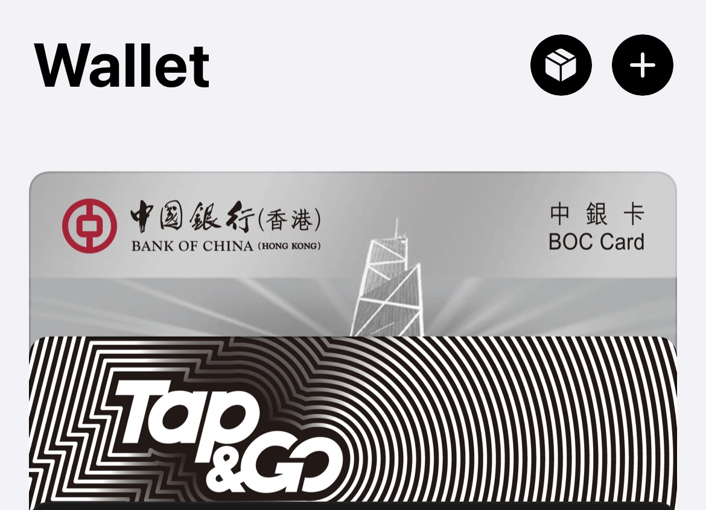

以美团支付和上海公交卡充值为例，支付时选择 Apple Pay ，选择中银卡或 Tap & GO 卡支付即可

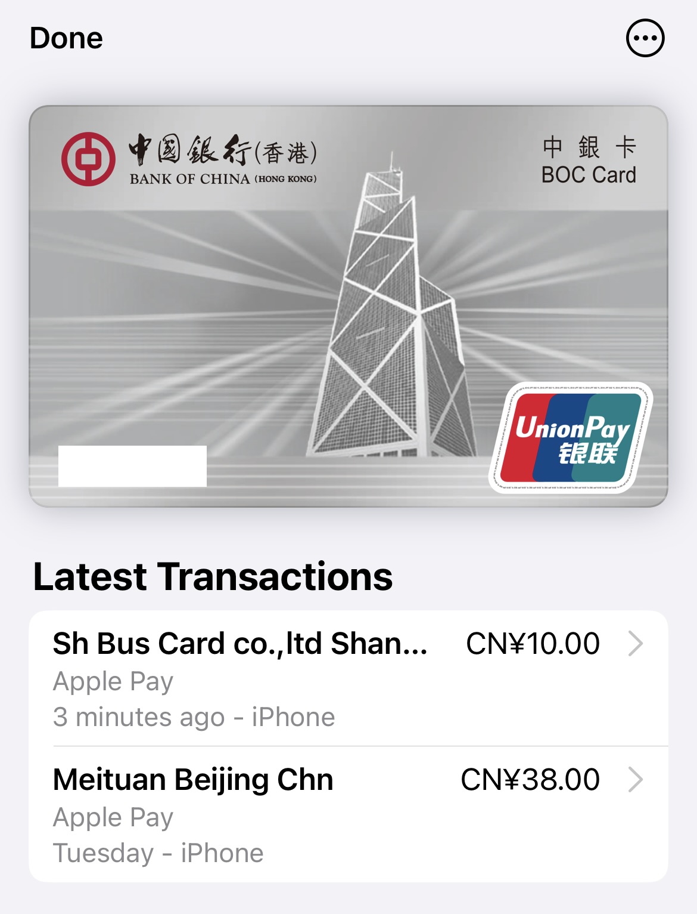

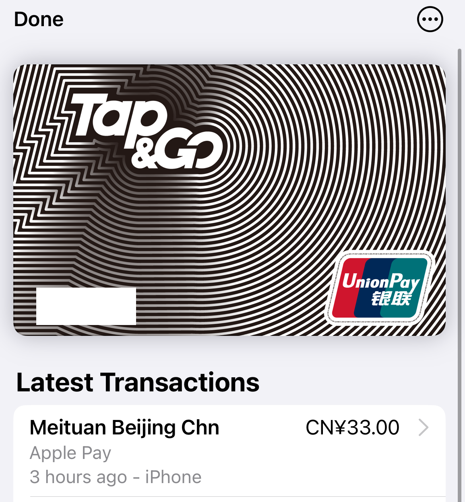

其中，中银扣款账户为离岸人民币外汇账户，Tap&GO 扣款账户为银联人民币账户

# 云闪付

使用香港手机号注册云闪付，可以绑定 Tap&GO 银联卡，中银卡借记卡则绑定失败，希望有老板支招

云闪付功能比较丰富，可以支持美团及京东消费，甚至可以使用内置公交二维码搭乘地铁，扣款账户同样为 Tap&GO 银联人民币账户

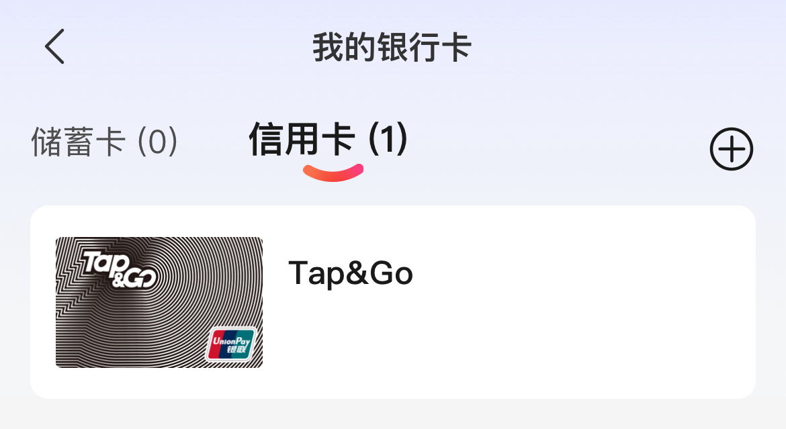

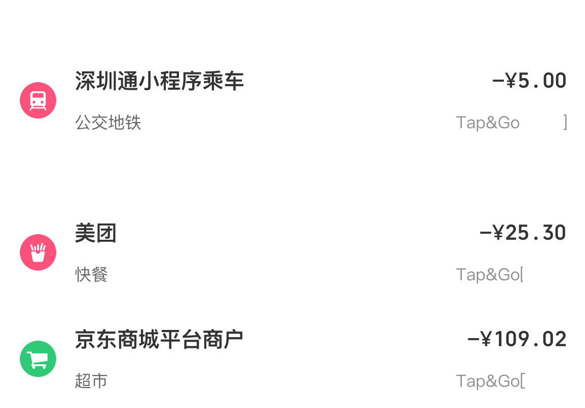

# WeChat Pay HK

有香港银行卡的老板可以开通 WeChat Pay HK，在微信“服务”页面选择“切换钱包地区”，再选择中国香港即可

仅绑定银行卡交易限额较低，绑定香港身份证之后限额较高

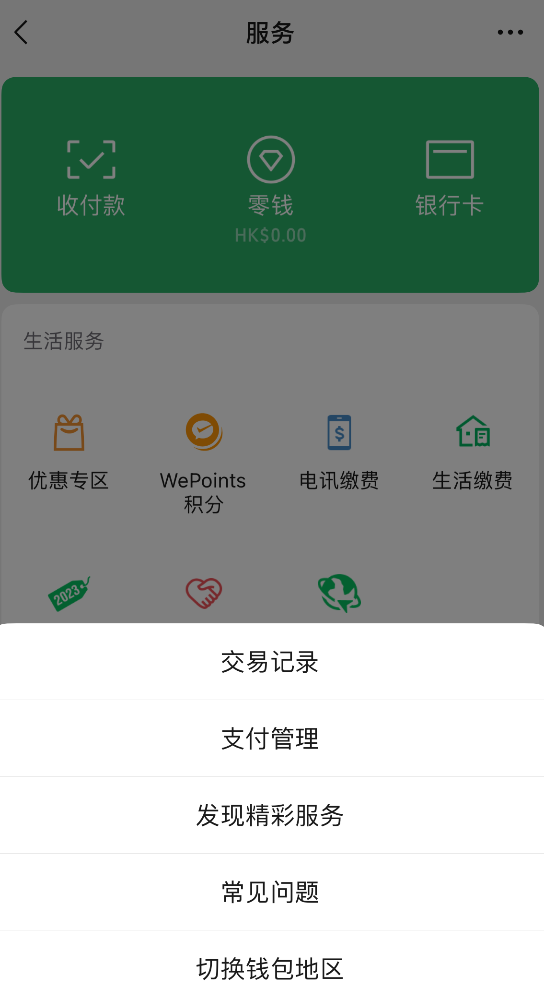

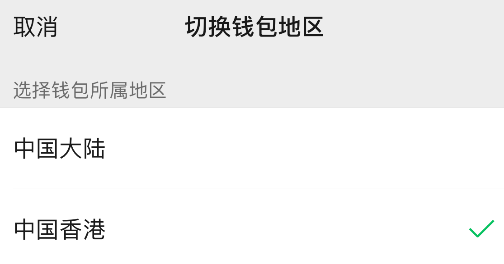

目前对下图最上面的5家银行支持较好，可以绑定中银香港智能账户

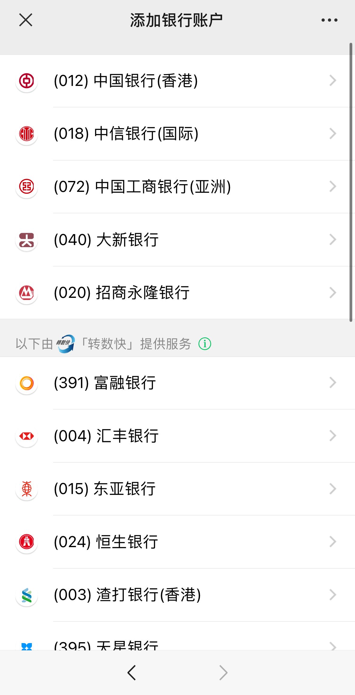

在内地正常通过 App 跳转微信支付或线下二维码支付均可，需要注意的是 WeChat Pay HK 使用中银智能账户付款，实时将人民币转换为港币扣款

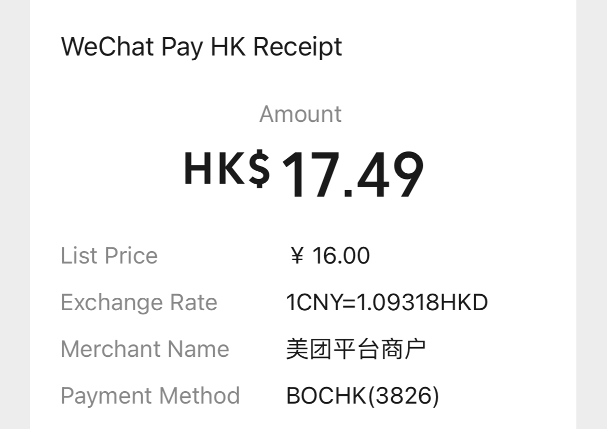

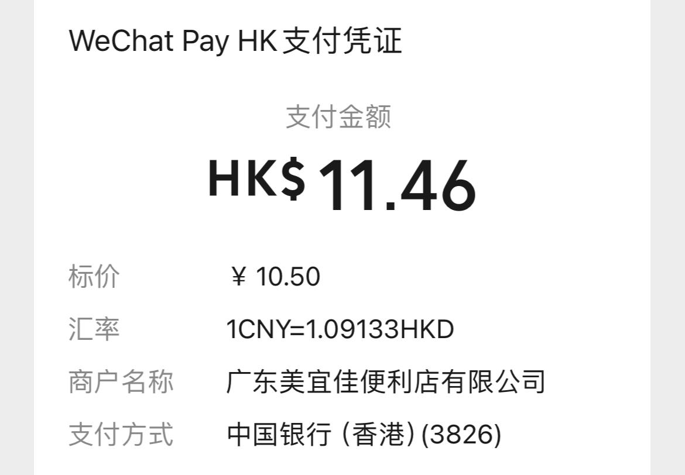

# AlipayHK

AlipayHK 和内地支付宝是两个独立的 App，使用香港手机号注册，绑定了中银香港账户，使用香港身份证认证后限额较高

使用体验反而不如云闪付和 WeChat Pay HK

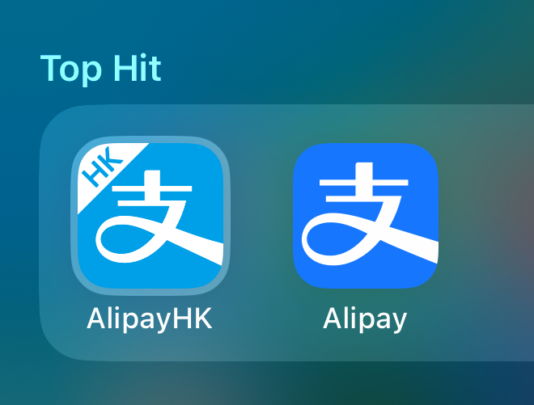

可以扫描内地付款二维码使用港币付款

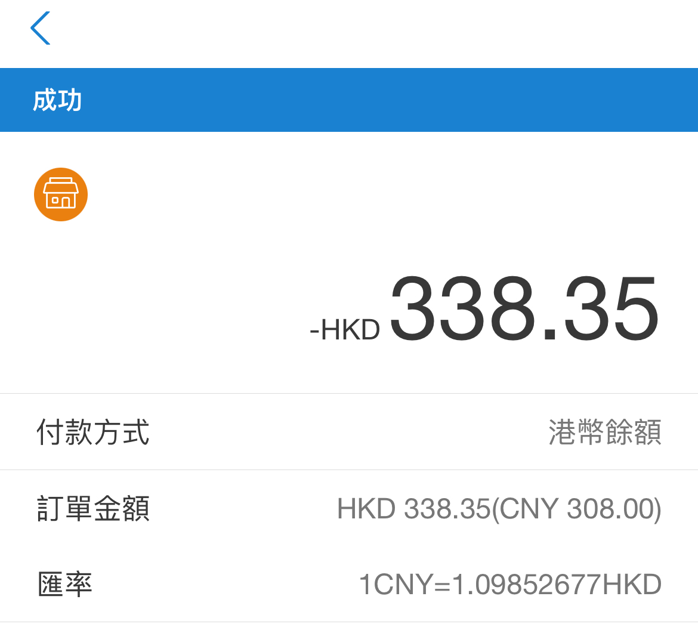