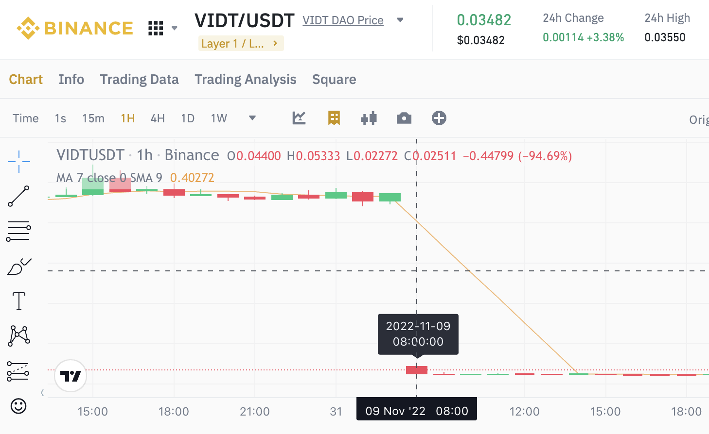

# 币安代币拆分合并与重上架的研究

众所周知，保温杯策略是一种做多山寨币的交易策略。本文旨在对山寨币的拆分合并以及下架后重上架机制进行研究，并提出数据处理的建议。

理论上，这些研究可以帮助防止由于相关机制处理不当导致的保温杯策略回测错误。

## 从 VIDT 说起

首先我们来观察 VIDT 这个山寨币的现货行情。

在 2022 年 10 月 31 日至 11 月 9 日这段时间内，如下图所示，VIDT 的价格发生了显著的跳空变动：



那么在这期间发生了什么呢？根据[币安官方公告](https://www.binance.com/en/support/announcement/binance-will-support-the-vidt-datalink-vidt-token-swap-redenomination-rebranding-plan-to-vidt-dao-vidt-ef40b40af1944bc9b399ad9c52861a04)：

- 2022-10-31 03:00 (UTC)，币安下架 VIDT/USDT、VIDT/BUSD、VIDT/BTC 这几个交易对。
- 2022-11-09 08:00 (UTC)，币安重新上架 VIDT/USDT、VIDT/BUSD、VIDT/BTC 交易对。
- 重新上架后，`1旧代币 = 10新代币`。

这意味着，在这段时间里，VIDT 完成了一次**代币拆分**。

## 检查 VIDT 数据

接下来我们审视一下相关数据。使用以下代码，载入 BHDS 根据 quantclass 官网币对分类生成的 parquet 数据：

``` python
def read(type_, symbol):
    if type_ == 'spot':
        df = pd.read_parquet(os.path.join(SPOT_DIR, f'{symbol}.pqt'))
    elif type_ == 'usdt_futures':
        df = pd.read_parquet(os.path.join(USDT_FUTURES_DIR, f'{symbol}.pqt'))

    return df[['candle_begin_time', 'open', 'high', 'low', 'close', 'volume']]

read('spot', 'VIDTUSDT').loc['2022-10-31 02:00:00+00:00':].head()
```

输出结果如下：


可以看到，在 2022 年 10 月 31 日至 11 月9 日这段时间，约有 9 天的行情数据缺失，并且价格从 0.4731 下跌至 0.044。

现在，我们基于以下代码，寻找所有的行情缺失：

``` python
def check(df):    
    df['time_diff'] = df['candle_begin_time'].diff()

    gaps = []
    idxes = df[df['time_diff'] > df['time_diff'].min()].index
    for idx in idxes:
        tail = df.loc[:idx].tail(2)
        begin_time_before = tail.iloc[0]['candle_begin_time']
        begin_time_after = tail.iloc[1]['candle_begin_time']
        time_gap = begin_time_after - begin_time_before
        price_change = tail.iloc[1]['open'] / tail.iloc[0]['close'] - 1
        gaps.append((begin_time_after, time_gap, price_change))

    return pd.DataFrame(gaps, columns=['relist_time', 'time_gap', 'price_change'])

def check_gaps(type_, symbol):
    df = read(type_, symbol)
    df_result = check(df)
    df_result['type'] = type_
    df_result['symbol'] = symbol
    return df_result

print(check_gaps('spot', 'VIDTUSDT').to_markdown(index=False))
```

输出结果如下：

| relist_time               | time_gap        | price_change   | type | symbol   |
|:--------------------------|:----------------|---------------:|:-----|:---------|
| 2021-09-29 09:00:00+00:00 | 0 days 03:00:00 | 0.000516929    | spot | VIDTUSDT |
| 2022-11-09 08:00:00+00:00 | 9 days 06:00:00 | -0.906996      | spot | VIDTUSDT |
| 2023-03-24 14:00:00+00:00 | 0 days 03:00:00 | -0.00166482    | spot | VIDTUSDT |

我们可以看到，自 VIDT 最初上架以来，共出现了三次数据缺失。其中最长的一次为 9 天，价格下降了约 90%；其他两次缺失仅为 3 小时，价格变化较小，可忽略。

针对这种情况，我们提出以下数据处理建议：

- 对于长达 9 天的代币拆分，应将拆分重上架前后的行情分为两个独立的 symbol，并在计算因子及回测时单独处理。
- 对于两次 3 小时的数据缺失，我们可以将其视为技术失误导致的数据缺失，直接使用横盘线填充即可，即开、高、低、收的价格均用前一收盘价填充，交易量用 0 填充。

## 对全量数据的研究

基于 VIDT 的研究，我们将这些方法推广到全量数据，进行更广泛的数据检查。

### 被研究的 symbol 范围

首先，我们确定研究范围，该范围与保温杯策略大致相符，核心代码如下：

``` python
STABLECOINS = {'BKRWUSDT', 'USDCUSDT', 'USDPUSDT', 'TUSDUSDT', 'BUSDUSDT', 'FDUSDUSDT', 'DAIUSDT', 'EURUSDT', 'GBPUSDT',
               'USBPUSDT', 'SUSDUSDT', 'PAXGUSDT', 'AEURUSDT'}

BLACKLIST = {'NBTUSDT'}

def filter_symbols(symbols):
    # 过滤杠杆代币，但要注意 JUP 不能过滤
    lev_symbols = {x for x in symbols if x.endswith(('UPUSDT', 'DOWNUSDT', 'BEARUSDT', 'BULLUSDT')) and x != 'JUPUSDT'}
    
    # 过滤非 USDT 交易对
    not_usdt_symbols = {x for x in symbols if not x.endswith('USDT')}

    # 添加稳定币和黑名单
    excludes = set.union(not_usdt_symbols, lev_symbols, STABLECOINS, BLACKLIST).intersection(symbols)

    symbols_filtered = sorted(set(symbols) - excludes)
    return symbols_filtered
```

其中，相比保温杯默认设置，增加了 AEUR 这个稳定币。NBT 由于数据质量太差且已长时间下架，因此同样被添加到黑名单中。

### 现货

利用以下代码，我们生成所有现货交易对的缺失数据，并以两天为阈值，筛选出数据缺失时间超过两天的情况：

``` python
symbols = get_filtered_symbols('spot')

dfs = [check_gaps('spot', symbol) for symbol in symbols]
dfs = [df for df in dfs if len(df)]
df_gap = pd.concat(dfs, ignore_index=True)

threshold = pd.Timedelta(days=2)

df_gap_short = df_gap[df_gap['time_gap'] < threshold]
df_gap_long = df_gap[df_gap['time_gap'] >= threshold].reset_index(drop=True)

display(df_gap_long)
```

输出结果如下：

| relist_time               | time_gap          |   price_change | type   | symbol    |
|:--------------------------|:------------------|---------------:|:-------|:----------|
| 2023-02-22 08:00:00+00:00 | 6 days 06:00:00   |     -0.99      | spot   | BNXUSDT   |
| 2021-03-19 07:00:00+00:00 | 4 days 01:00:00   |     -0.900002  | spot   | BTCSTUSDT |
| 2021-01-23 02:00:00+00:00 | 4 days 01:00:00   |    999         | spot   | COCOSUSDT |
| 2023-05-12 08:00:00+00:00 | 154 days 06:00:00 |     -0.0899796 | spot   | CVCUSDT   |
| 2021-04-02 04:00:00+00:00 | 4 days 01:00:00   |     99.0076    | spot   | DREPUSDT  |
| 2023-09-22 08:00:00+00:00 | 311 days 04:00:00 |     -0.31909   | spot   | FTTUSDT   |
| 2023-03-10 08:00:00+00:00 | 28 days 06:00:00  |      0.840514  | spot   | KEYUSDT   |
| 2022-05-31 06:00:00+00:00 | 18 days 06:00:00  |  19999         | spot   | LUNAUSDT  |
| 2023-07-21 08:00:00+00:00 | 4 days 06:00:00   |     -0.999     | spot   | QUICKUSDT |
| 2024-03-28 08:00:00+00:00 | 8 days 06:00:00   |     -0.9       | spot   | STRAXUSDT |
| 2021-06-18 04:00:00+00:00 | 4 days 01:00:00   |     -0.999     | spot   | SUNUSDT   |
| 2018-10-19 09:00:00+00:00 | 88 days 06:00:00  |     -0.999945  | spot   | VENUSDT   |
| 2022-11-09 08:00:00+00:00 | 9 days 06:00:00   |     -0.906996  | spot   | VIDTUSDT  |

以上这些币种均存在超过 2 天的长时间的数据缺失，且前后价格通常有极大差异，这通常预示着代币发生了拆分或合并。

建议将这些事件前后的数据拆分为两个独立的 symbol。

对于小于 2 天的短期数据缺失，我们可以查看统计数据：

``` python
df_gap_short.describe([.01, .1, .9, .99])
```

输出结果为：

|       | time_gap                  |   price_change |
|:------|:--------------------------|---------------:|
| count | 7754                      | 7754           |
| mean  | 0 days 02:55:12.612844983 |   -2.27507e-05 |
| std   | 0 days 01:51:53.365951751 |    0.00527826  |
| min   | 0 days 02:00:00           |   -0.0414446   |
| 1%    | 0 days 02:00:00           |   -0.0161004   |
| 10%   | 0 days 02:00:00           |   -0.00461637  |
| 50%   | 0 days 02:00:00           |    0           |
| 90%   | 0 days 05:00:00           |    0.00452761  |
| 99%   | 0 days 11:00:00           |    0.0159473   |
| max   | 1 days 10:00:00           |    0.0586466   |

虽然短期数据缺失发生了 7700 多次，但绝大多数的缺失时长在 5 小时以下，最长也不超过 1.5 天，并且前后的价格变化通常非常小。因此，这些缺失可以全部用横盘线填充。

### 合约

合约数据通常质量较高，主要问题仍是那些因重上架而知名的几个交易对，例如 ICP, BNX, TLM。其他缺失数据可以忽略，使用横盘线填充即可。

| relist_time               | time_gap          |   price_change | type         | symbol   |
|:--------------------------|:------------------|---------------:|:-------------|:---------|
| 2019-09-08 19:00:00+00:00 | 0 days 02:00:00   |     0.034477   | usdt_futures | BTCUSDT  |
| 2019-09-09 02:00:00+00:00 | 0 days 03:00:00   |    -0.00721831 | usdt_futures | BTCUSDT  |
| 2019-11-27 10:00:00+00:00 | 0 days 02:00:00   |     0.0691729  | usdt_futures | ETHUSDT  |
| 2021-03-02 02:00:00+00:00 | 0 days 02:00:00   |    -0.00228447 | usdt_futures | BLZUSDT  |
| 2021-03-02 02:00:00+00:00 | 0 days 02:00:00   |     0.00188201 | usdt_futures | CTKUSDT  |
| 2021-03-02 02:00:00+00:00 | 0 days 02:00:00   |    -0.00205245 | usdt_futures | DODOUSDT |
| 2021-03-02 02:00:00+00:00 | 0 days 02:00:00   |     0          | usdt_futures | LITUSDT  |
| 2022-09-27 02:00:00+00:00 | 108 days 17:00:00 |     0.0263975  | usdt_futures | ICPUSDT  |
| 2023-02-22 14:00:00+00:00 | 11 days 15:00:00  |    -0.987751   | usdt_futures | BNXUSDT  |
| 2023-03-30 12:00:00+00:00 | 294 days 04:00:00 |    -0.402594   | usdt_futures | TLMUSDT  |

## 不对拆分合并做处理可能导致的问题

如果不对代币拆分合并进行适当处理，可能会导致因子计算出现严重错误。

以保温杯默认策略计算的 LUNAUSDT PctChange因子为例：

| candle_begin_time   |   PctChange_3 |   PctChange_7 |   PctChange_10 |   PctChange_14 |
|:--------------------|--------------:|--------------:|---------------:|---------------:|
| 2022-05-26 00:00:00 |       0       |             0 |              0 |      -0.999954 |
| 2022-05-27 00:00:00 |       0       |             0 |              0 |      -0.84375  |
| 2022-05-28 00:00:00 |       0       |             0 |              0 |       0        |
| 2022-05-29 00:00:00 |       0       |             0 |              0 |       0        |
| 2022-05-30 00:00:00 |       0       |             0 |              0 |       0        |
| 2022-05-31 00:00:00 |       0       |             0 |              0 |       0        |
| 2022-06-01 00:00:00 |  177399       |        177399 |         177399 |  177399        |
| 2022-06-02 00:00:00 |  130589       |        130589 |         130589 |  130589        |
| 2022-06-03 00:00:00 |  142049       |        142049 |         142049 |  142049        |
| 2022-06-04 00:00:00 |      -0.26841 |        129783 |         129783 |  129783        |

由于 LUNA 发生暴雷并重上架，导致最后几行的 PctChange 因子计算出现了严重错误。