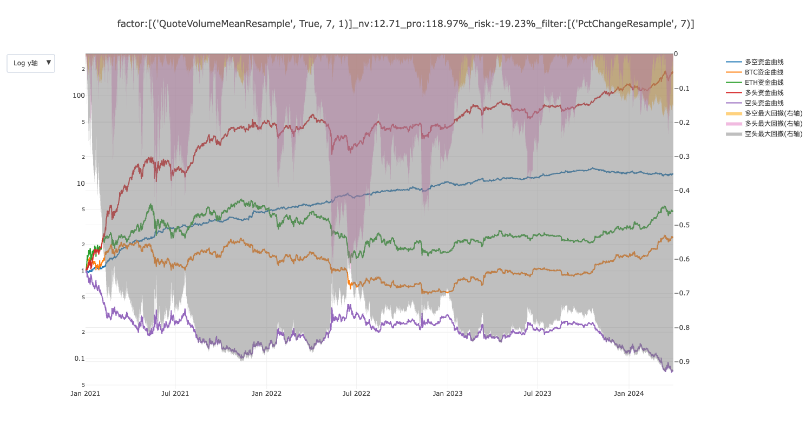
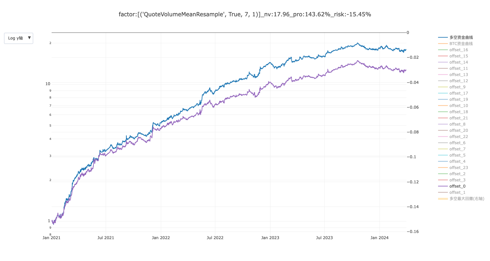

# 基于多offset resample，轻松将保温杯1D策略扩展为24个offset版本

众所周知，保温杯策略默认采用日线数据和1D持仓周期，并固定于每日UTC 0点进行换仓。这种换仓时间的刻板性可能导致风险较集中。

如果简单地将保温杯策略从 1D 改为 24H 周期，并将选币/过滤因子的回看周期乘以24倍，那么由于振幅、标准差等统计量的不可加性，这可能导致 24H 周期的 offset0 与 1D 周期的选币结果不完全对应。

本文介绍一种基于多 offset resample 的方法，通过该方法可以基于 1 小时 K 线数据计算出 24 个 offset 版本的 1D K 线指标，其中 offset0 的结果与原始 1D 选币结果完全一致，从而轻松实现 1D 策略到 24 个 offset 版本的扩展。

本文可视为本人之前作业帖[【lostleaf】【保温杯中性回测】基于NetTaBuyStd...](https://bbs.quantclass.cn/thread/33290)的进一步发展。因子计算步骤如下：

1. 利用 1H K 线数据，resample 出 24 个 offset 版本的 1D K线。
2. 在这 24 个 offset 版本的 1D K 线上，分别运用原有因子计算函数，得到带 offset 的 1D 因子。
3. 将所有计算出的因子与原始 1H K 线数据合并。

下文中，我将演示如何对目前所有由邢大提供的保温杯因子进行 resample 转换，并使用 BTCUSDT 现货 1H 和 1D K 线数据来验证转换的正确性。

最后，我将展示如何对原始 1D 策略进行微调，以便扩展到持仓周期 24H 的 24 个 offset 版本，同时确保其中的 offset0 与原 1D 策略保持一致。

## 读取数据和验证因子改造前后一致性的辅助函数

首先定义以下函数，用于读取数据和验证因子改造前后的一致性：

``` python
# 读取 CSV 文件到 Pandas DataFrame
def read(time_interval):
    df = pd.read_csv(f'BTCUSDT_spot_{time_interval}.csv', parse_dates=['candle_begin_time'])
    return df

# 比较函数，用于验证基于 1D K线计算的因子和基于 Resample 1H K线计算的因子之间的一致性
def compare(df_d, day_col, df_h, hour_col):
    df_d['candle_end_time'] = df_d['candle_begin_time'] + pd.Timedelta(days=1)
    df_h['candle_end_time'] = df_h['candle_begin_time'] + pd.Timedelta(hours=1)

    df_join = pd.merge(df_d[['candle_end_time', day_col]],
                       df_h[['candle_end_time', hour_col]],
                       on='candle_end_time',
                       how='left')
    rel_err = (df_join[day_col] / df_join[hour_col] - 1).abs()

    # 如果最大相对误差小于万分之一，则认为结果一致
    if rel_err.max() < 0.0001:
        print(f'{day_col} {hour_col} all correct, max rel_err {rel_err.max()}')
    else:
        print(f'{day_col} {hour_col} has error, max rel_err {rel_err.max()}')
```

## 因子1: TradeNumMeanV1

改造为因子 `TradeNumMeanV1Resample`

``` python
# -*- coding: utf-8 -*-
import pandas as pd


# TradeNumMeanV1 计算函数
def signal_d(*args):
    df: pd.DataFrame = args[0]
    n = args[1]
    factor_name = args[2]

    df['振幅'] = (df['high'] - df['low']) / df['open']
    df['factor'] = df['振幅'] / df['trade_num']

    df[factor_name] = df['factor'].rolling(n, min_periods=1).mean()
    df.drop(columns=['振幅', 'factor'], inplace=True)

    return df


agg = {'open': 'first', 'high': 'max', 'low': 'min', 'close': 'last', 'volume': 'sum', 'trade_num': 'sum'}


def signal(*args):
    df: pd.DataFrame = args[0]
    n = args[1]
    factor_name = args[2]

    day_dfs = []
    for offset in range(24):
        # resample 为带 offset 的 1D K线
        df_d = df.resample('D', offset=f'{offset}H', on='candle_begin_time').agg(agg).reset_index()
        # 添加 candle_end_time，为对齐做准备
        df_d['candle_end_time'] = df_d['candle_begin_time'] + pd.Timedelta(days=1)
        # 调用原有计算函数计算因子
        df_d = signal_d(df_d, n, factor_name)
        day_dfs.append(df_d)

    df_d = pd.concat(day_dfs)
    df_d.sort_values('candle_begin_time', ignore_index=True, inplace=True)

    df['candle_end_time'] = df['candle_begin_time'] + pd.Timedelta(hours=1)

    # 基于 candle_end_time 对齐
    df = df.join(df_d.set_index('candle_end_time')[factor_name], on=['candle_end_time'])
    # 去除 candle_end_time
    df.drop(columns='candle_end_time', inplace=True)
    return df
```

验证正确性

``` python
import TradeNumMeanV1
import TradeNumMeanV1Resample

df_d = read('1d')
df_d = TradeNumMeanV1.signal(df_d, 7, 'TradeNumMeanV1_7')

df_h = read('1h')
df_h = TradeNumMeanV1Resample.signal(df_h, 7, 'TradeNumMeanV1Re_7')

compare(df_d, 'TradeNumMeanV1_7', df_h, 'TradeNumMeanV1Re_7')
```

测试结果

```
TradeNumMeanV1_7 TradeNumMeanV1Re_7 all correct, max rel_err 0.0
```

## 因子2: PctChange

改造为因子 `PctChangeResample`

```python
# -*- coding: utf-8 -*-
import pandas as pd


def signal_d(*args):
    df: pd.DataFrame = args[0]
    n = args[1]
    factor_name = args[2]

    df[factor_name] = df['close'].pct_change(n)

    return df


agg = {'open': 'first', 'high': 'max', 'low': 'min', 'close': 'last', 'volume': 'sum', 'trade_num': 'sum'}


def signal(*args):
    df: pd.DataFrame = args[0]
    n = args[1]
    factor_name = args[2]

    day_dfs = []
    for offset in range(24):
        df_d = df.resample('D', offset=f'{offset}H', on='candle_begin_time').agg(agg).reset_index()
        df_d['candle_end_time'] = df_d['candle_begin_time'] + pd.Timedelta(days=1)
        df_d = signal_d(df_d, n, factor_name)
        day_dfs.append(df_d)

    df_d = pd.concat(day_dfs)
    df_d.sort_values('candle_begin_time', ignore_index=True, inplace=True)

    df['candle_end_time'] = df['candle_begin_time'] + pd.Timedelta(hours=1)
    df = df.join(df_d.set_index('candle_end_time')[factor_name], on=['candle_end_time'])
    df.drop(columns='candle_end_time', inplace=True)
    return df
```

验证正确性

```python
import PctChange
import PctChangeResample

df_d = read('1d')
df_d = PctChange.signal(df_d, 7, 'PctChange_7')

df_h = read('1h')
df_h = PctChangeResample.signal(df_h, 7, 'PctChangeRe_7')

compare(df_d, 'PctChange_7', df_h, 'PctChangeRe_7')
```

测试结果

```
PctChange_7 PctChangeRe_7 all correct, max rel_err 0.0
```

## 因子3: QuoteVolumeMean

改造为因子 `QuoteVolumeMeanResample`

```python
# -*- coding: utf-8 -*-

import pandas as pd


def signal_d(*args):
    df = args[0]
    n = args[1]
    factor_name = args[2]

    df[factor_name] = df['quote_volume'].rolling(n, min_periods=1).mean()

    return df


agg = {
    'open': 'first',
    'high': 'max',
    'low': 'min',
    'close': 'last',
    'volume': 'sum',
    'trade_num': 'sum',
    'quote_volume': 'sum'
}


def signal(*args):
    df: pd.DataFrame = args[0]
    n = args[1]
    factor_name = args[2]

    day_dfs = []
    for offset in range(24):
        df_d = df.resample('D', offset=f'{offset}H', on='candle_begin_time').agg(agg).reset_index()
        df_d['candle_end_time'] = df_d['candle_begin_time'] + pd.Timedelta(days=1)
        df_d = signal_d(df_d, n, factor_name)
        day_dfs.append(df_d)

    df_d = pd.concat(day_dfs)
    df_d.sort_values('candle_begin_time', ignore_index=True, inplace=True)

    df['candle_end_time'] = df['candle_begin_time'] + pd.Timedelta(hours=1)
    df = df.join(df_d.set_index('candle_end_time')[factor_name], on=['candle_end_time'])
    df.drop(columns='candle_end_time', inplace=True)
    return df
```

验证正确性

```python
import QuoteVolumeMean
import QuoteVolumeMeanResample

df_d = read('1d')
df_d = QuoteVolumeMean.signal(df_d, 7, 'QuoteVolumeMean_7')

df_h = read('1h')
df_h = QuoteVolumeMeanResample.signal(df_h, 7, 'QuoteVolumeMeanRe_7')

compare(df_d, 'QuoteVolumeMean_7', df_h, 'QuoteVolumeMeanRe_7')
```

测试结果

```
QuoteVolumeMean_7 QuoteVolumeMeanRe_7 all correct, max rel_err 5.551115123125783e-16
```

## 因子4: ILLQMean

改造为因子 `ILLQMeanResample`

```python
import pandas as pd


def signal_d(*args):
    df = args[0]
    n = args[1]
    factor_name = args[2]

    df['route_1'] = 2 * (df['high'] - df['low']) + (df['open'] - df['close'])
    df['route_2'] = 2 * (df['high'] - df['low']) + (df['close'] - df['open'])
    df.loc[df['route_1'] > df['route_2'], '盘中最短路径'] = df['route_2']
    df.loc[df['route_1'] <= df['route_2'], '盘中最短路径'] = df['route_1']
    df['最短路径_标准化'] = df['盘中最短路径'] / df['open']
    df['流动溢价'] = df['quote_volume'] / df['最短路径_标准化']

    df[factor_name] = df['流动溢价'].rolling(n).mean()

    df.drop(columns=['route_1', 'route_2', '盘中最短路径', '最短路径_标准化', '流动溢价'], inplace=True)

    return df


agg = {
    'open': 'first',
    'high': 'max',
    'low': 'min',
    'close': 'last',
    'volume': 'sum',
    'trade_num': 'sum',
    'quote_volume': 'sum'
}


def signal(*args):
    df: pd.DataFrame = args[0]
    n = args[1]
    factor_name = args[2]

    day_dfs = []
    for offset in range(24):
        df_d = df.resample('D', offset=f'{offset}H', on='candle_begin_time').agg(agg).reset_index()
        df_d['candle_end_time'] = df_d['candle_begin_time'] + pd.Timedelta(days=1)
        df_d = signal_d(df_d, n, factor_name)
        day_dfs.append(df_d)

    df_d = pd.concat(day_dfs)
    df_d.sort_values('candle_begin_time', ignore_index=True, inplace=True)

    df['candle_end_time'] = df['candle_begin_time'] + pd.Timedelta(hours=1)
    df = df.join(df_d.set_index('candle_end_time')[factor_name], on=['candle_end_time'])
    df.drop(columns='candle_end_time', inplace=True)
    return df

```

验证正确性

```python
import ILLQMean
import ILLQMeanResample

df_d = read('1d')
df_d = ILLQMean.signal(df_d, 7, 'ILLQMean_7')

df_h = read('1h')
df_h = ILLQMeanResample.signal(df_h, 7, 'ILLQMeanResample_7')

compare(df_d, 'ILLQMean_7', df_h, 'ILLQMeanResample_7')
```

测试结果

```
ILLQMean_7 ILLQMeanResample_7 all correct, max rel_err 4.440892098500626e-16
```

## 因子5: ILLQStd

改造为因子 `ILLQStdResample`

```python
# -*- coding: utf-8 -*-
import pandas as pd


def signal_d(*args):
    df = args[0]
    n = args[1]
    factor_name = args[2]

    df['route_1'] = 2 * (df['high'] - df['low']) + (df['open'] - df['close'])
    df['route_2'] = 2 * (df['high'] - df['low']) + (df['close'] - df['open'])
    df.loc[df['route_1'] > df['route_2'], '盘中最短路径'] = df['route_2']
    df.loc[df['route_1'] <= df['route_2'], '盘中最短路径'] = df['route_1']
    df['最短路径_标准化'] = df['盘中最短路径'] / df['open']
    df['流动溢价'] = df['quote_volume'] / df['最短路径_标准化']

    df[factor_name] = df['流动溢价'].rolling(n, min_periods=2).std()

    del df['route_1']
    del df['route_2']
    del df['盘中最短路径']
    del df['最短路径_标准化']
    del df['流动溢价']

    return df


agg = {
    'open': 'first',
    'high': 'max',
    'low': 'min',
    'close': 'last',
    'volume': 'sum',
    'trade_num': 'sum',
    'quote_volume': 'sum'
}


def signal(*args):
    df: pd.DataFrame = args[0]
    n = args[1]
    factor_name = args[2]

    day_dfs = []
    for offset in range(24):
        df_d = df.resample('D', offset=f'{offset}H', on='candle_begin_time').agg(agg).reset_index()
        df_d['candle_end_time'] = df_d['candle_begin_time'] + pd.Timedelta(days=1)
        df_d = signal_d(df_d, n, factor_name)
        day_dfs.append(df_d)

    df_d = pd.concat(day_dfs)
    df_d.sort_values('candle_begin_time', ignore_index=True, inplace=True)

    df['candle_end_time'] = df['candle_begin_time'] + pd.Timedelta(hours=1)
    df = df.join(df_d.set_index('candle_end_time')[factor_name], on=['candle_end_time'])
    df.drop(columns='candle_end_time', inplace=True)
    return df

```

验证正确性

```python
import ILLQStd
import ILLQStdResample

df_d = read('1d')
df_d = ILLQStd.signal(df_d, 7, 'ILLQStd_7')

df_h = read('1h')
df_h = ILLQStdResample.signal(df_h, 7, 'ILLQStdResample_7')

compare(df_d, 'ILLQStd_7', df_h, 'ILLQStdResample_7')
```

测试结果

```
ILLQStd_7 ILLQStdResample_7 all correct, max rel_err 6.209144309821113e-12
```


## 因子6: NetTaBuyStd

改造为因子 `NetTaBuyStdResample`

```python
# -*- coding: utf-8 -*-
import pandas as pd


def signal_d(*args):
    df = args[0]
    n = args[1]
    factor_name = args[2]

    df['NetBuy'] = df['taker_buy_quote_asset_volume'] * 2 - df['quote_volume']
    df[factor_name] = df['NetBuy'].rolling(n, min_periods=2).std()

    return df


agg = {
    'open': 'first',
    'high': 'max',
    'low': 'min',
    'close': 'last',
    'volume': 'sum',
    'trade_num': 'sum',
    'quote_volume': 'sum',
    'taker_buy_quote_asset_volume': 'sum'
}


def signal(*args):
    df: pd.DataFrame = args[0]
    n = args[1]
    factor_name = args[2]

    day_dfs = []
    for offset in range(24):
        df_d = df.resample('D', offset=f'{offset}H', on='candle_begin_time').agg(agg).reset_index()
        df_d['candle_end_time'] = df_d['candle_begin_time'] + pd.Timedelta(days=1)
        df_d = signal_d(df_d, n, factor_name)
        day_dfs.append(df_d)

    df_d = pd.concat(day_dfs)
    df_d.sort_values('candle_begin_time', ignore_index=True, inplace=True)

    df['candle_end_time'] = df['candle_begin_time'] + pd.Timedelta(hours=1)
    df = df.join(df_d.set_index('candle_end_time')[factor_name], on=['candle_end_time'])
    df.drop(columns='candle_end_time', inplace=True)
    return df

```

验证正确性

```python
import NetTaBuyStd
import NetTaBuyStdResample

df_d = read('1d')
df_d = NetTaBuyStd.signal(df_d, 7, 'NetTaBuyStd_7')

df_h = read('1h')
df_h = NetTaBuyStdResample.signal(df_h, 7, 'NetTaBuyStdResample_7')

compare(df_d, 'NetTaBuyStd_7', df_h, 'NetTaBuyStdResample_7')
```

测试结果
```
NetTaBuyStd_7 NetTaBuyStdResample_7 all correct, max rel_err 9.618972285352356e-13
```

## 因子7: QuoteVolumeStd

改造为因子 `QuoteVolumeStdResample`

```python
# -*- coding: utf-8 -*-
import pandas as pd


def signal_d(*args):
    df = args[0]
    n = args[1]
    factor_name = args[2]

    df[factor_name] = df['quote_volume'].rolling(n, min_periods=2).std()

    return df


agg = {
    'open': 'first',
    'high': 'max',
    'low': 'min',
    'close': 'last',
    'volume': 'sum',
    'trade_num': 'sum',
    'quote_volume': 'sum'
}


def signal(*args):
    df: pd.DataFrame = args[0]
    n = args[1]
    factor_name = args[2]

    day_dfs = []
    for offset in range(24):
        df_d = df.resample('D', offset=f'{offset}H', on='candle_begin_time').agg(agg).reset_index()
        df_d['candle_end_time'] = df_d['candle_begin_time'] + pd.Timedelta(days=1)
        df_d = signal_d(df_d, n, factor_name)
        day_dfs.append(df_d)

    df_d = pd.concat(day_dfs)
    df_d.sort_values('candle_begin_time', ignore_index=True, inplace=True)

    df['candle_end_time'] = df['candle_begin_time'] + pd.Timedelta(hours=1)
    df = df.join(df_d.set_index('candle_end_time')[factor_name], on=['candle_end_time'])
    df.drop(columns='candle_end_time', inplace=True)
    return df

```

验证正确性

```python
import QuoteVolumeStd
import QuoteVolumeStdResample

df_d = read('1d')
df_d = QuoteVolumeStd.signal(df_d, 7, 'QuoteVolumeStd_7')

df_h = read('1h')
df_h = QuoteVolumeStdResample.signal(df_h, 7, 'QuoteVolumeStdResample_7')

compare(df_d, 'QuoteVolumeStd_7', df_h, 'QuoteVolumeStdResample_7')
```

测试结果

```
QuoteVolumeStd_7 QuoteVolumeStdResample_7 all correct, max rel_err 4.616307336391401e-13
```

## 扩展 Strategy_QuoteVolumeMean 策略

修改以下几行代码，构造 `Strategy_QuoteVolumeMeanH` 策略

```python
hold_period = '24H'

factor_list = [
    ('QuoteVolumeMeanResample', True, 7, 1)  # 因子名（和factors文件中相同），排序方式，参数，权重。
]

filter_list = [
    ('PctChangeResample', 7)  # 因子名（和factors文件中相同），参数
]
```

修改 `config.py`

```python
strategy_name = 'Strategy_QuoteVolumeMeanH'
factor_class_list = ['QuoteVolumeMeanResample', 'PctChangeResample']  # 计算指定因子列表
```

`Strategy_QuoteVolumeMeanH` 完整代码如下

``` python
# -*- coding: utf-8 -*-
"""
中性策略框架 | 邢不行 | 2024分享会
author: 邢不行
微信: xbx6660
"""
import os

# 取出策略文件名中_后的部分
stg_name = os.path.basename(__file__).split('.')[0].split('_')[1]

# 持仓周期。目前回测支持日线级别、小时级别。例：1H，6H，3D，7D......
# 当持仓周期为D时，选币指标也是按照每天一根K线进行计算。
# 当持仓周期为H时，选币指标也是按照每小时一根K线进行计算。
hold_period = '24H'
# 配置offset
offset = 0
# 是否使用现货
if_use_spot = True  # True：使用现货。False：不使用现货，只使用合约。

# 多头选币数量。1 表示做多一个币; 0.1 表示做多10%的币
long_select_coin_num = 0.1
# 空头选币数量。1 表示做空一个币; 0.1 表示做空10%的币
# short_select_coin_num = 0.1
short_select_coin_num = 'long_nums'  # long_nums意为着空头数量和多头数量保持一致。最多为所有合约的数量。注意：多头为0的时候，不能配置'long_nums'

# 多头的选币因子列名。
long_factor = '因子'  # 因子：表示使用复合因子，默认是 factor_list 里面的因子组合。需要修改 calc_factor 函数配合使用
# 空头的选币因子列名。多头和空头可以使用不同的选币因子
short_factor = '因子'

# 选币因子信息列表，用于`2_选币_单offset.py`，`3_计算多offset资金曲线.py`共用计算资金曲线
factor_list = [
    ('QuoteVolumeMeanResample', True, 7, 1)  # 因子名（和factors文件中相同），排序方式，参数，权重。
]

# 确认过滤因子及其参数，用于`2_选币_单offset.py`进行过滤
filter_list = [
    ('PctChangeResample', 7)  # 因子名（和factors文件中相同），参数
]


def after_merge_index(df, symbol, factor_dict, data_dict):
    """
    合并指数数据之后的处理流程，非必要。
    本函数住要的作用如下：
            1、指定K线上不常用的数据在resample时的规则，例如：'taker_buy_quote_asset_volume': 'sum'
            2、合并外部数据，并指定外部数据在resample时的规则。例如：（伪代码）
                    chain_df = pd.read_csv(chain_path + symbol)  # 读取指定币种链上数据
                    df = pd.merge(df,chain_df,'left','candle_begin_time') # 将链上数据合并到日线上
                    factor_dict['gas_total'] = 'sum' # 链上的gas_total字段，在小时数据转日线数据时用sum处理
                    data_dict['gas_total'] = 'sum' # 链上的gas_total字段，在最后一次resample中的处理规则
    :param df:
    :param symbol:
    :param factor_dict: 小时级别resample到日线级别时使用(计算日线级别因子时需要，计算小时级别因子时不需要)
    :param data_dict: resample生成最终数据时使用
    :return:
    """

    # 专门处理转日线是的resample规则
    factor_dict['taker_buy_quote_asset_volume'] = 'sum'  # 计算日线级别因子前先resample到日线数据
    factor_dict['trade_num'] = 'sum'

    return df, factor_dict, data_dict


def after_resample(df, symbol):
    """
    数据重采样之后的处理流程，非必要
    :param df:          传入的数据
    :param symbol:      币种名称
    :return:
    """

    return df


# =====================以上是数据整理部分封装转的策略代码==========================
# ============================================================================
# ============================================================================
# ============================================================================
# ============================================================================
# =======================以下是选币函数封装的策略代码=============================


def calc_factor(df, **kwargs):
    """
    计算因子

    多空使用相同的两个因子

        1。多空相同的单因子选币，不需要编写代码

        2。多空相同的复合因子，本案例代码不需要修改，直接使用即可。《本案例代码就是多空相同的复合因子选币》

    多空使用不同的两个因子

        1。多空不同的单因子选币，不需要编写代码

        2。多空分离选币，需要根据具体因子具体改写
            !!!!!!!!!!!!!!!!!!!!!!!!!!!!!!!!
            !!!!!这里改写需要一定的代码能力!!!!!
            !!!!!!!!!!!!!!!!!!!!!!!!!!!!!!!!
            多空存在某一方是复合因子，另一方是单因子，则只需要计算一个复合因子即可。代码可以参考下方案例代码

            如果多空都是复合因子，多空需要分别是计算复合因子。

    :param df:          原数据
    :return:
    """
    # 接受外部回测的因子列表，这里主要是去适配`4_遍历选币参数.py`
    external_list = kwargs.get('external_list', [])
    if external_list:  # 如果存在外部回测因子列表，则使用外部因子列表
        _factor_list = external_list
    else:  # 如过不存在外部回测因子列表，默认使用当前策略的因子列表
        _factor_list = factor_list

    # 多空相同的复合因子计算
    if long_factor == short_factor == '因子':
        df[long_factor] = 0
        for factor_name, if_reverse, parameter_list, weight in _factor_list:
            col_name = f'{factor_name}_{str(parameter_list)}'
            # 计算单个因子的排名
            df[col_name + '_rank'] = df.groupby('candle_begin_time')[col_name].rank(ascending=if_reverse, method='min')
            # 将因子按照权重累加
            df[long_factor] += (df[col_name + '_rank'] * weight)

    return df


def before_filter(df, **kwargs):
    """
    前置过滤函数
    自定义过滤规则，可以对多空分别自定义过滤规则

    :param df:                  原始数据
    :return:                    过滤后的数据
    """
    # 接受外部回测的因子列表，这里主要是去适配`5_查看历年参数平原.py`
    ex_filter_list = kwargs.get('ex_filter_list', [])
    if ex_filter_list:  # 如果存在外部回测因子列表，则使用外部因子列表
        _filter_list = ex_filter_list
    else:  # 如过不存在外部回测因子列表，默认使用当前策略的因子列表
        _filter_list = filter_list

    df_long = df.copy()
    df_short = df.copy()

    # 如果过滤列表中只有一个因子
    if len(_filter_list) == 1:
        filter_factor = _filter_list[0][0] + '_' + str(_filter_list[0][1])
        # 配置了过滤因子信息，则进行过滤操作
        df_long['filter_rank'] = df_long.groupby('candle_begin_time')[filter_factor].rank(ascending=True, pct=True)
        df_long = df_long[(df_long['filter_rank'] < 0.8)]

        df_short['filter_rank'] = df_short.groupby('candle_begin_time')[filter_factor].rank(ascending=True, pct=True)
        df_short = df_short[(df_short['filter_rank'] < 0.8)]
    else:  # 如果使用多个因子进行过滤，在这里进行填写

        pass

    return df_long, df_short
```

以下分别文原版和改造后的资金曲线，完全一致




生成全 offset 资金曲线，并与 offset0 对比



可以发现，通过覆盖全 offset，可以降低回撤并提高收益率