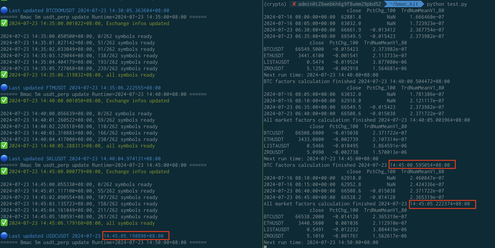

# 【BMAC2.0-后传】BmacKit: 基于 BMAC 异步高效因子计算架构

在量化交易实盘中，部署了 BMAC 并获取了数据之后，作为交易策略的第一步，首先需要计算因子。

本文发布了 BmacKit，即基于 BMAC 的标准因子计算工具，理论上是“Pandas + 文件”基础架构下的最优解。

## 核心接口

BmacKit 核心包括两个类，`BmacSingleSymbolCalculator` 和 `BmacAllMarketCalculator`，其中：

- `BmacSingleSymbolCalculator`: 单标的多因子计算器，适用于时序趋势类策略。
- `BmacAllMarketCalculator`: 全市场多标的多因子计算器，适用于截面选币类策略。

BmacKit 使用非常简单：每个核心类仅包含构造函数与因子计算函数，定义如下，全代码在 `bmac_kit.py` 中。

`BmacSingleSymbolCalculator`: 

``` python
class BmacSingleSymbolCalculator:

    def __init__(self,
                 symbol: str,
                 candle_reader: CandleFileReader,
                 factor_cfgs: list,
                 package: str = 'factor',
                 bmac_expire_sec: int = 40):
        """
        symbol: 标的名称
        candle_reader: K 线存放目录的 CandleFileReader
        factor_cfgs: 因子列表，例如 [('PctChg', 100), ('TrdNumMeanV1', 80)]
        package: 因子包名，默认为 'factor'
        bmac_expire_sec: BMAC 超时时间(秒)，默认 40 秒
        """
        ...

    async def calc_factors(self, run_time: datetime, symbol=None) -> pd.DataFrame:
        """
        run_time: 当前周期时间戳
        
        返回值: 包含给定 symbol 所有周期所有因子的 DataFrame
        """
        ...


class BmacAllMarketCalculator(BmacSingleSymbolCalculator):

    def __init__(self,
                 exginfo_reader: CandleFileReader,
                 candle_reader: CandleFileReader,
                 factor_cfgs: list,
                 package: str = 'factor',
                 bmac_expire_sec: int = 40):
        """
        exginfo_reader: exchange info 存放目录的 CandleFileReader
        candle_reader: K 线存放目录的 CandleFileReader
        factor_cfgs: 因子列表，例如 [('PctChg', 100), ('TrdNumMeanV1', 80)]
        package: 因子包名，默认为 'factor'
        bmac_expire_sec: BMAC 超时时间(秒)，默认 40 秒
        """

    async def calc_all_factors(self, run_time: datetime) -> pd.DataFrame:
        """
        run_time: 当前周期时间戳
        
        返回值: 包含给定全市场 run_time 周期所有因子的 DataFrame
        """
```

## 使用案例

以下是一个 BmacKit 实盘因子计算的例子，仅展示核心代码，全代码在 `test.py` 中：

``` python
# 导入 BmacKit 
from bmac_kit import BmacSingleSymbolCalculator, CandleFileReader, now_time, BmacAllMarketCalculator

# 运行周期
TIME_INTERVAL = '5m'

# BMAC 目录
CANDLE_DIR = '../usdt_perp_5m_all_v2/usdt_perp_5m'
EXGINFO_DIR = '../usdt_perp_5m_all_v2/exginfo_5m'

# 因子列表
FACTOR_LIST = [('PctChg', 100), ('TrdNumMeanV1', 80)]

async def main():
    # 当前 run_time
    run_time = next_run_time(TIME_INTERVAL) - convert_interval_to_timedelta(TIME_INTERVAL)

    # 初始化 CandleFileReader
    exginfo_reader = CandleFileReader(EXGINFO_DIR, 'parquet')
    candle_reader = CandleFileReader(CANDLE_DIR, 'parquet')

    # 初始化，BmacKit 因子计算器
    calc = BmacSingleSymbolCalculator('BTCUSDT', candle_reader, FACTOR_LIST)
    all_calc = BmacAllMarketCalculator(exginfo_reader, candle_reader, FACTOR_LIST)

    # 测试因子计算
    df_factor_single = await calc.calc_factors(run_time)
    df_factor_all = await all_calc.calc_all_factors(run_time)

    # 抽样显示因子
    show_df(df_factor_single)
    show_df(df_factor_all)

    while True:
        # 计算下个周期 run_time
        run_time = next_run_time(TIME_INTERVAL)

        print('Next run time:', run_time)
        await sleep_until_run_time(run_time)

        # 计算 BTCUSDT 单 symbol 因子
        df_factor_single = await calc.calc_factors(run_time)
        print('BTC factors calculation finished', now_time())
        show_df(df_factor_single)

        # 计算全市场因子
        df_factor_all = await all_calc.calc_all_factors(run_time)
        print('All market factors calculation finished', now_time())
        show_df(df_factor_all)
```

其中，BMAC 参数为:

```json
{
    "interval": "5m",
    "trade_type": "usdt_perp",
    "num_candles": 2000,
    "dingding": {
        "error": {
            "access_token": "f...",
            "secret": "SEC..."
        }
    }
}
```

运行截图



注意几个关键的时间点：对于 `BTCUSDT` 这样的主流币，在周期开始的 500 毫秒左右就能计算好因子；对于全市场，在接收到最后一个交易对 K 线后的 100 毫秒内，所有交易对的因子都已经计算完毕。

因此，使用 BmacKit 能非常高效地计算因子。

