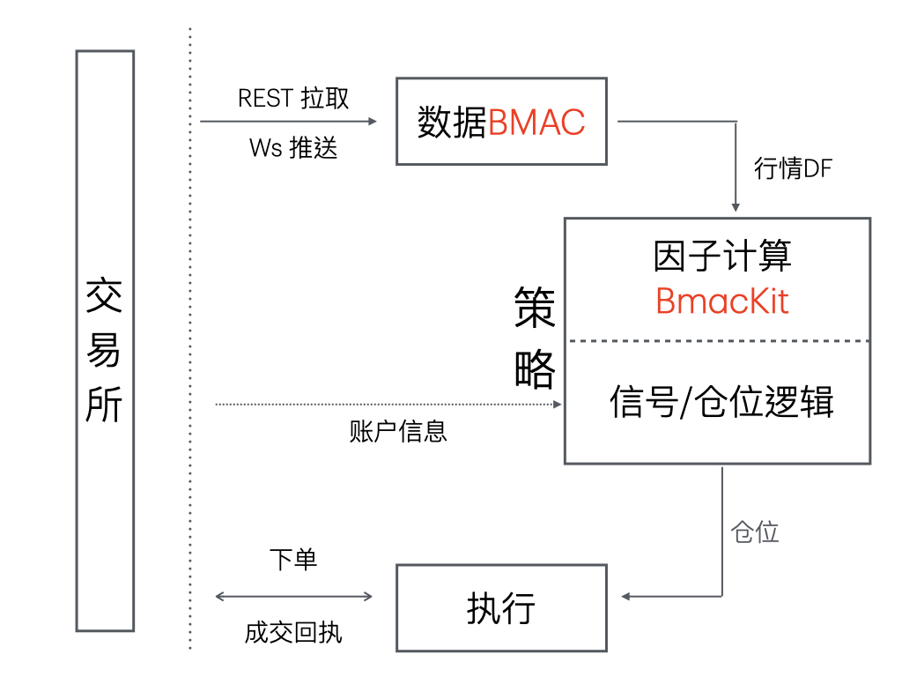
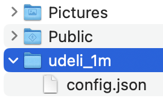
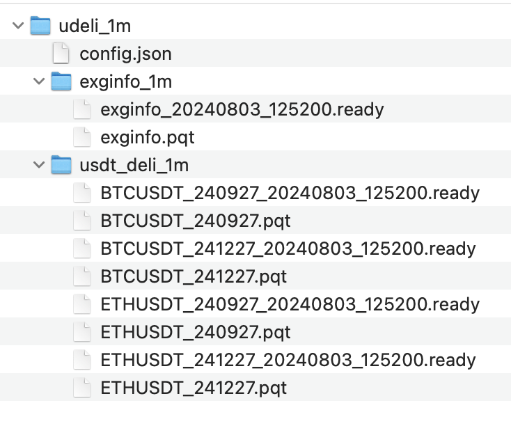
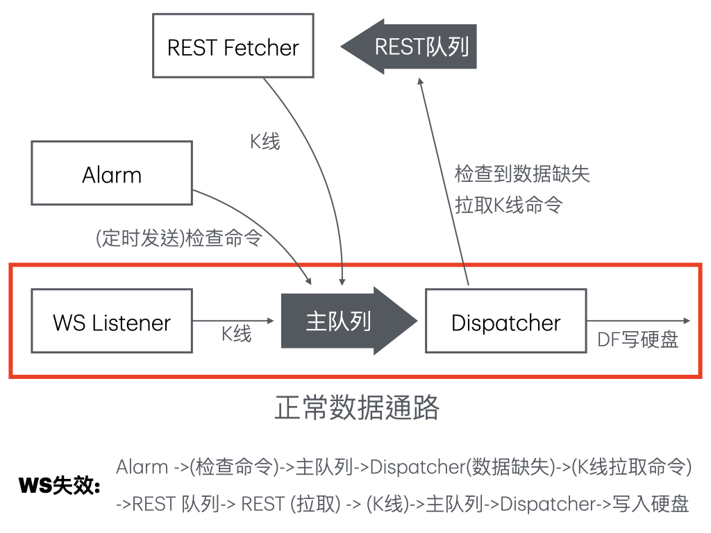
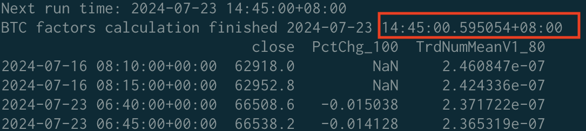
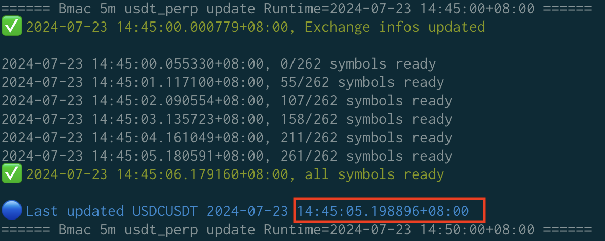
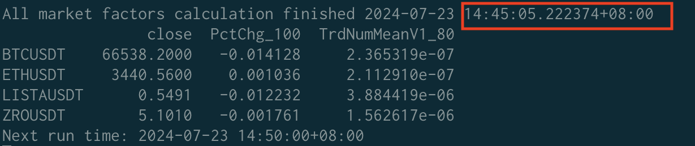

<!-- headingDivider: 2 -->

# BMAC v2: 币安异步实盘行情框架

**B**inance
**M**arketdata
**A**sync
**C**lient

牛马直播：*帖子 43314, 44366, 44984, 45170*

By lostleaf, github.com/lostleaf/binance_datatool

## 目录

1. Binance DataTool & BMAC 简介
1. BMAC 环境与配置
1. BMAC 原理简介（异步多协程）
1. 应用1: BmacKit，因子计算
1. 应用2: BMAC X 中性实盘框架3，数据中心
1. BMAC v2 反思

## Binance DataTool & BMAC

Binance DataTool, 币安数据框架，lostleaf 主导，基于 MIT 协议开源，

仅访问公有数据 API，无需账户 API Key，不修改币安账户信息，仅访问指定数据目录

- BMAC：币安异步实盘行情框架，WS + REST

- BHDS：币安历史行情数据框架，AWS 数据中心 + REST

小白：Linux 命令行工具，进阶框架，有难度

牛马：自由修改/测试，邢大API+BMAC（稳上加稳？），欢迎贡献（表扬菊老板）

> MIT协议: 尊重作者著作权，允许修改或测试软件，与作者无关

## 实盘软件工程

自动交易**客户端**

数据：单向交互
BMAC 实盘行情

BmacKit 因子

执行：双向交互




# BMAC 环境与配置

帖子 44366

## Conda 环境

Binance DataTool 自带 `environment.yml`

创建 Conda 环境并激活，环境名默认为 crypto：

```
conda env create --file environment.yml
conda activate crypto
```

BMAC 运行在 Python asyncio, 主要使用的库

- `aiohttp`: REST API 请求
- `websockets`: WS 数据接收
- `pandas`: DataFrame 转化与硬盘输出
- `fire`: 命令行封装

如果要使用 BHDS，还需要安装 `aria2`

## 配置

新建文件夹作为基础目录，例如 `~/udeli_1m`，编写配置文件 `config.json`



一个最小化配置, USDT 交割合约 1 分钟线:

``` json
{
    "interval": "1m",
    "trade_type": "usdt_deli"
}
```

## 运行

入口点 `python cli.py bmac start`

运行 BMAC

```
python cli.py bmac start ~/udeli_1m
```

## 运行阶段1: 初始化历史数据

多轮历史数据下载，每轮 499 根[(zdq老板34266)](https://bbs.quantclass.cn/thread/34266)，保存为 DataFrame

```
================== Start Bmac V2 2024-08-03 12:50:03 ===================
🔵 interval=1m, type=usdt_deli, num_candles=1500, funding_rate=False, keep_symbols=None
🔵 Candle data dir /home/admin/udeli_1m/usdt_deli_1m, initializing
🔵 Exchange info data dir /home/admin/udeli_1m/exginfo_1m, initializing
--------------- Init history round 1 2024-08-03 12:50:30 ---------------
Server time: 2024-08-03 12:50:30.122000+08:00, Used weight: 2
Symbol range: BTCUSDT_240927 -- ETHUSDT_241227
--------------- Init history round 2 2024-08-03 12:50:30 ---------------
Server time: 2024-08-03 12:50:30.261000+08:00, Used weight: 9
Symbol range: BTCUSDT_240927 -- ETHUSDT_241227
--------------- Init history round 3 2024-08-03 12:50:30 ---------------
Server time: 2024-08-03 12:50:30.421000+08:00, Used weight: 14
Symbol range: BTCUSDT_240927 -- ETHUSDT_241227
--------------- Init history round 4 2024-08-03 12:50:30 ---------------
Server time: 2024-08-03 12:50:30.599000+08:00, Used weight: 20
Symbol range: BTCUSDT_240927 -- ETHUSDT_241227
✅ 4 finished, 0 left

✅ History initialized, Server time: 2024-08-03 12:50:30.775000+08:00, Used weight: 25
```

## 运行阶段2: 实时行情更新

通过 Websocket，实时行情数据

```
Create WS listen group 0, 1 symbols
Create WS listen group 1, 1 symbols
Create WS listen group 3, 1 symbols
Create WS listen group 5, 1 symbols
====== Bmac 1m usdt_deli update Runtime=2024-08-03 12:51:00+08:00 ======
✅ 2024-08-03 12:51:00.000132+08:00, Exchange infos updated

2024-08-03 12:51:00.046084+08:00, 0/4 symbols ready
2024-08-03 12:51:01.006133+08:00, 1/4 symbols ready
2024-08-03 12:51:02.008255+08:00, 1/4 symbols ready
2024-08-03 12:51:03.009653+08:00, 1/4 symbols ready
✅ 2024-08-03 12:51:04.010863+08:00, all symbols ready

🔵 Last updated ETHUSDT_241227 2024-08-03 12:51:03.067731+08:00
====== Bmac 1m usdt_deli update Runtime=2024-08-03 12:52:00+08:00 ======
...
```

## 运行目录结构

可交易标的信息

K 线行情

ready file 文件锁

传递 DF 给策略

默认 parquet 格式




## 核心参数

两个核心参数

`interval` K 线时间周期，可以是 1m、5m、1h、4h 等币安官方支持的周期

`trade_type` 交易标的类型
- `usdt_spot`: USDT 本位现货，`BTCUSDT` `ETHUSDT`等
- `btc_spot`: BTC 本位现货，`ETHBTC` 等
- `usdt_perp`: USDT 本位永续，`BTCUSDT`永续等
- `coin_perp`: 币本位永续，`BTCUSD`币本位永续等

参考[帖子44366](https://bbs.quantclass.cn/thread/44366) **核心参数**一节

## 可选参数

`num_candles`: 保留 K 线数量，默认 1500，不得超过 10000

`funding_rate`: 是否获取资金费率，默认 False

`keep_symbols`: symbol 白名单，如有则只获取白名单内的 symbol，默认 None

`save_type`: K 线数据存储格式，默认 parquet，也可为 feather

`dingding`: 钉钉配置，默认 None

```json
"dingding": {
    "error": {
        "access_token": "f...",
        "secret": "SEC..."
    }
}
```

参考[帖子44366](https://bbs.quantclass.cn/thread/44366) **可选参数**一节


# BMAC 原理简介

部分参考 43314，35389

## 初始化历史数据

和邢大基础课程原理类似，不涉及 Websocket

通过 REST API 获取足够的历史数据，控制权重，分批获取

参考[帖子35389](https://bbs.quantclass.cn/thread/35389)

## 实盘数据更新：多协程，生产者-消费者架构

生产者，接收并提供数据

- `CandleListener`: 通过 WS 接收行情数据推送, 抽取自 python-binance
- `RestFetcher`: 通过 REST API 拉取行情数据；也是 K 线拉取命令的消费者
- `PeriodAlarm`: 发出拉取 ExgInfo、检查数据完整性命令，相当于 Runtime 循环

消费者`Dispatcher`，处理生产者提供的数据，只有消费者访问硬盘，防止读写错乱

- 执行拉取 ExgInfo 命令，写入硬盘，有变动时调整 `CandleListener` 订阅
- 处理行情数据、资金费等，写入硬盘
- 检查行情数据完整性，如有缺失，发出 K 线拉取命令

生产者和消费者通过**队列**通信
- 主队列 `main_que`: 生产者和 `Dispatcher` 通信
- REST 队列 `rest_que`: `Dispatcher` 和 `RestFetcher` 通信

## 数据通路

3 生产

1 消费

2 队列



# 应用1: BmacKit，因子计算

帖子 44984

## 实盘因子计算

经典动量因子，`factors.PctChg`，如何通过 BMAC 实盘计算？

``` python
import pandas as pd


def signal(*args):
    df: pd.DataFrame = args[0]
    n = args[1]
    factor_name = args[2]
    df[factor_name] = df['close'].pct_change(n)

    return df

```

BmacKit ! 

跟随西大潮流，BMAC 实盘因子计算开发包

## BmacSingleSymbolCalculator

单标的多因子计算器，适用于时序趋势类策略

```python
class BmacSingleSymbolCalculator:

    def __init__(self,
                 symbol: str,
                 candle_reader: CandleFileReader,
                 factor_cfgs: list,
                 package: str = 'factor',
                 bmac_expire_sec: int = 40):
        """
        symbol: 标的名称
        candle_reader: K 线存放目录的 CandleFileReader
        factor_cfgs: 因子列表，例如 [('PctChg', 100), ('TrdNumMeanV1', 80)]
        package: 因子包名，默认为 'factor'
        bmac_expire_sec: BMAC 超时时间(秒)，默认 40 秒
        """
        ...

    async def calc_factors(self, run_time: datetime, symbol=None) -> pd.DataFrame:
        """
        run_time: 当前周期时间戳
    
        返回值: 包含给定 symbol 所有周期所有因子的 DataFrame
        """
        ...
```

## BmacSingleSymbolCalculator 案例

```python
# 导入 BmacKit 
from bmac_kit import BmacSingleSymbolCalculator, CandleFileReader, now_time
# 运行周期
TIME_INTERVAL = '5m'
# BMAC 目录
CANDLE_DIR = '../usdt_perp_5m_all_v2/usdt_perp_5m'
# 因子列表
FACTOR_LIST = [('PctChg', 100), ('TrdNumMeanV1', 80)]
```

```python
# 当前 run_time
run_time = next_run_time(TIME_INTERVAL)
# 初始化 CandleFileReader
candle_reader = CandleFileReader(CANDLE_DIR, 'parquet')
# 初始化，BmacKit 因子计算器
calc = BmacSingleSymbolCalculator('BTCUSDT', candle_reader, FACTOR_LIST)
# 测试因子计算
df_factor_single = await calc.calc_factors(run_time)
```

## BmacSingleSymbolCalculator 计算结果截图



由于使用了 WS，1 秒以内可以完成 BTCUSDT 因子计算

## BmacAllMarketCalculator

全市场多标的多因子计算器，适用于截面选币类策略

```python
class BmacAllMarketCalculator(BmacSingleSymbolCalculator):

    def __init__(self,
                 exginfo_reader: CandleFileReader,
                 candle_reader: CandleFileReader,
                 factor_cfgs: list,
                 package: str = 'factor',
                 bmac_expire_sec: int = 40):
        """
        exginfo_reader: exchange info 存放目录的 CandleFileReader
        candle_reader: K 线存放目录的 CandleFileReader
        factor_cfgs: 因子列表，例如 [('PctChg', 100), ('TrdNumMeanV1', 80)]
        package: 因子包名，默认为 'factor'
        bmac_expire_sec: BMAC 超时时间(秒)，默认 40 秒
        """

    async def calc_all_factors(self, run_time: datetime) -> pd.DataFrame:
        """
        run_time: 当前周期时间戳
    
        返回值: 包含给定全市场 run_time 周期所有因子的 DataFrame
        """
```

## BmacAllMarketCalculator 案例

导入和因子定义与 BmacSingleSymbolCalculator 相同

```python
# 当前 run_time
run_time = next_run_time(TIME_INTERVAL)

# 初始化 CandleFileReader
exginfo_reader = CandleFileReader(EXGINFO_DIR, 'parquet')
candle_reader = CandleFileReader(CANDLE_DIR, 'parquet')

# 初始化，BmacKit 因子计算器
all_calc = BmacAllMarketCalculator(exginfo_reader, candle_reader, FACTOR_LIST)

# 测试因子计算
df_factor_all = await all_calc.calc_all_factors(run_time)
```

异步计算全市场因子，几乎没有额外延迟

-----





# 应用2: BMAC X 中性实盘框架3，数据中心

帖子45170

## 主要改动

以 BMAC K 线数据作为数据源的中性框架 v3 版本 data job

生成 5 分钟全 offset 小时线

1. 把原有从 API 获取 symbol 列表，改为从 bmac exginfo 获取列表
2. 把原有从 API 获取 5 分钟线，改为从 bmac 获取 K 线
3. 删除了 funding fee 相关（保温杯用不到

具体参考 [帖子45170](https://bbs.quantclass.cn/thread/45170)

## 反思, BMAC v2 足够好吗？

优点：使用 WS，不大量消耗权重，高频数据可能性
缺点：单线程多协程，硬盘 IO 瓶颈

更好的架构，适用于中高频交易/日内波段
微服务化：
- ZMQ pub/sub (Domain/TCP Socket)
- Receiver(pub): WS + REST 接收行情
- Recorder(sub): 录制历史行情写入硬盘
- Strategy(sub): 历史行情初始化(硬盘)，实时行情交易(ZMQ Socket)
- BmacKit: 抛弃 Pandas，流式在线计算，(JIT)编译型语言

注1：不适用于超高频（做市）
注2：小心走火入魔

## 谢谢

Github: lostleaf/binance_datatool

43314[【BMAC2.0-前传】利用 asyncio 和 Websocket 获取并录制币安 K 线行情](https://bbs.quantclass.cn/thread/43314)
44366[【BMAC2.0-正传（上）】BMAC2的配置与使用](https://bbs.quantclass.cn/thread/44366)
44984[【BMAC2.0-后传】BmacKit: 基于 BMAC 异步高效因子计算架构](https://bbs.quantclass.cn/thread/44984)
45170[【BMAC X 中性框架3】bmac_kline: 以 BMAC 为数据源的中性实盘全 offset 小时线 data job](https://bbs.quantclass.cn/thread/45170)