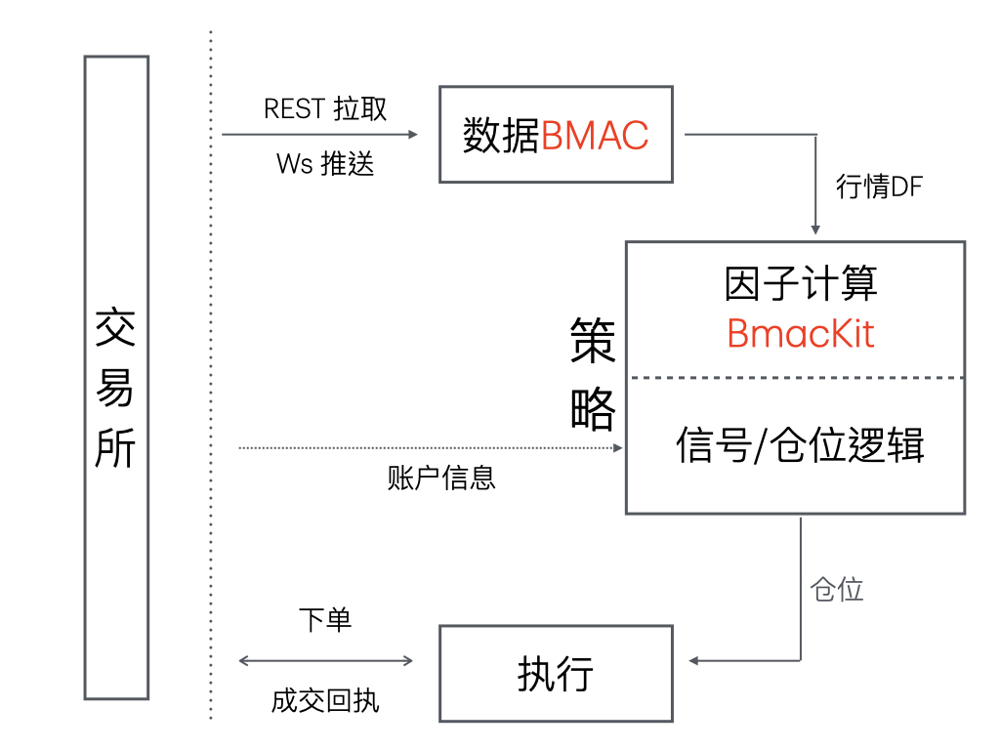

<!-- headingDivider: 2 -->

# 2025 牛马一期

By lostleaf

bbs.quantclass.cn/user/3166

# 计划

1. BMAC 性能增强
1. 回测框架增强：回测模式升级，基于 5 分钟线的全 offset 回测

# BMAC

**B**inance **M**arketdata **A**sync **C**lient

数据：单向交互

执行：双向交互

BMAC 实盘行情
BmacKit 因子计算

# BMAC 性能增强

- 首先，数据层需要服务于因子计算层
- 因子计算（官方）：Pandas DataFrame + 文件
- 目标：提升CPU计算效率，减少内存占用，提升硬盘存储效率
- 代价：硬盘存储空间

# 回测框架增强

**问题引入**

日线选币策略，如何覆盖 288 个 5 分钟偏移？

# 回顾

- 回测框架：基于小时线回测，无法回测 5 分钟偏移
- 观点
    1. 技术债务
    1. 5分钟线计算：因子，权重
    1. 策略底层可以抛弃持仓周期和分钟偏移概念，关注换手率

## 解决方案 —— 数据 & 因子
    
- 数据:（如果使用较多，可否耶伦维护？） 
    1. 输出1: 生成带有开盘资金费率和 1 分钟 vwap 的 5 分钟线，生成 5 分钟透视表
    2. 输出2: Resample 出各个 Offset 的 1 小时线 / N 小时线 / 日线

- 因子：计算全 Offset 因子
    - 输出：每一个 5m 时间点，基于带偏移的 K 线，计算因子

观点：投研是试错过程，可以尝试引入 Polars，优化计算效率

[(51257)突破 Pandas 性能极限：探究用 Polars 加速 BMAC 分钟偏移实盘计算](https://bbs.quantclass.cn/thread/51257)

## 解决方案 —— 选币 & 持仓权重

- 选币：（无改动）
    - 输出：每一个 5m 时间点，计算选币权重（中间权重）
    - 例，T 周期选币：50% BTC，50% BNB；T-1 周期选币：50% BTC，50% ETH

- 权重聚合：基于 N 个 5m 历史周期，聚合计算持仓权重 
    - 输出：每一个 5m 时间点，计算持仓权重
    - 权重聚合算法：统一持仓周期和分钟偏移
    - 例，对最近 2 个历史周期，MA 聚合：50% BTC, 25% ETH, 25% BNB
    - 原有模式：选择特定的选币周期，MA 聚合权重
    - 拓展：采用 EMA 等 （组合优化？）

权重聚合算法 + 仓位映射算法(rebalance)：控制换手率

# 总结

对数据和持仓权重升级，基于 5 分钟线细粒度回测，分钟偏移任意覆盖，时间维度分散持仓

# 谢谢

bbs.quantclass.cn/user/3166

43314 [【BMAC2.0-前传】利用 asyncio 和 Websocket 获取并录制币安 K 线行情](https://bbs.quantclass.cn/thread/43314)
46937 [【BMAC 前传之二】基于 asyncio 实现高效批量下载币安历史 5 分钟线数据，并转换为全 offset 小时线](https://bbs.quantclass.cn/thread/46937)
44984 [【BMAC2.0-后传】BmacKit: 基于 BMAC 异步高效因子计算架构](https://bbs.quantclass.cn/thread/44984)
51257 [突破 Pandas 性能极限：探究用 Polars 加速 BMAC 分钟偏移实盘计算](https://bbs.quantclass.cn/thread/51257)